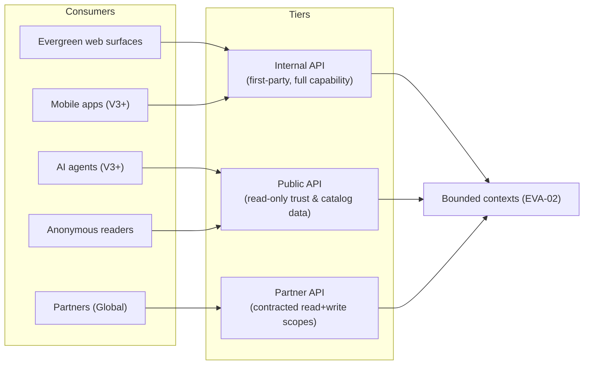

# Evergreen API Concept

| | |
|---|---|
| **Document ID** | EVA-09 |
| **Status** | Active |
| **Version** | 1.0.0 |
| **Owner** | Architecture Guild |
| **Last updated** | 2026-07-05 |

---

## 1. Purpose

Define Evergreen's API architecture across all phases: the internal API that powers
its own surfaces today, the public and partner APIs that make Evergreen an
infrastructure layer in the `Global` phase, and the access, versioning, and safety
rules they share. The API is how "trust rails" ([Roadmap §1](../roadmap/EVERGREEN_MASTER_ROADMAP.md))
eventually becomes a product.

## 2. Scope

**In scope:** API tiers (internal, public, partner), design conventions, mobile and
AI access, authentication, authorization, rate limiting, versioning, deprecation.

**Out of scope:** endpoint-by-endpoint reference (grows with implementation; the
prototype's route index at `GET /api` is the current record), data model
([EVA-04](EVERGREEN_PRODUCT_SCHEMA.md), [EVA-08](EVERGREEN_DATABASE_CONCEPT.md)),
embeddable badge rendering ([EVA-05 §8](EVERGREEN_BADGE_SYSTEM.md)).

## 3. Dependencies

- [EVA-02 Product Architecture](EVERGREEN_PRODUCT_ARCHITECTURE.md) — Layer 4
  (Access) position; bounded contexts APIs expose.
- [EVA-03 Information Architecture](EVERGREEN_INFORMATION_ARCHITECTURE.md) — public
  API resources mirror the IA's entity URLs.
- [EVA-08 Database Concept](EVERGREEN_DATABASE_CONCEPT.md) — snapshots and audit
  rules the API must respect.

## 4. Related Documents

| Document | Relationship |
|---|---|
| [EVA-05 Badge System](EVERGREEN_BADGE_SYSTEM.md) | Embeddable badges resolve grant state via the Public API |
| [EVA-06 Evidence Engine](EVERGREEN_EVIDENCE_ENGINE.md) | Evidence submission flows through Partner/Brand APIs |
| [EVA-10 System Principles](EVERGREEN_SYSTEM_PRINCIPLES.md) | *Transparency over Marketing* applied to API data |
| [Prototype implementation record](../ARCHITECTURE.md) | Current internal API (Express, JWT) |

## 5. Definitions

This document owns: **API Tier**, **Scope (API)**, **Deprecation Window**. Other
terms: [EVA-01 §7](EVERGREEN_KNOWLEDGE_SYSTEM.md#7-canonical-terminology-registry).

## 6. Architecture

### 6.1 API tiers

| Tier | Audience | Capability | Phase |
|---|---|---|---|
| **Internal** | Evergreen's own surfaces (web, later mobile) | Full: catalog, trust, commerce, portal, operations | MVP ⬥ (prototype `/api/*`) |
| **Public** | Anyone; AI agents; embeddable badges | Read-only: published Product Records, Trust Signals, badge pages, standards, transparency reports | design now, ship `Global` (read subset possibly V3) |
| **Partner** | Contracted organizations (retailers, researchers, brands-at-scale) | Public + bulk export, webhooks, evidence/product submission APIs | `Global` |

Tier rules:
1. **One data truth, three doors.** All tiers serve the same entities with the same
   honesty rules — the Public API never gets an "embellished" view, and Honest
   Unknown fields serialize as explicit `"unknown"`/`null` with their declared
   status, never omitted.
2. **Trust data is never paywalled at the fact level.** Partner tier adds
   *convenience* (bulk, webhooks, SLAs), not *access to truth* — consistent with
   the Business Model firewall (Roadmap §3.17).
3. Verification write-paths (Operator decisions) exist **only** in the Internal
   tier; no partner scope can ever influence trust outcomes.

### 6.2 Design conventions

- **Style:** resource-oriented JSON over HTTPS (REST); the prototype's `/api/*`
  conventions are the seed. GraphQL is a possible V3+ *addition* for the Public
  tier if consumer demand proves it — never a replacement.
- **Resources mirror the IA:** `/products/{slug}`, `/brands/{slug}`,
  `/categories/{slug}`, `/badges/{slug}`, `/standards/{id}` — same slugs as web
  URLs ([EVA-03 §6.5](EVERGREEN_INFORMATION_ARCHITECTURE.md)).
- **Every score ships its breakdown.** API responses carry Score Breakdowns and
  Standard/rule-set versions exactly as the PDP does — explainability is part of
  the contract, not a UI feature.
- **Pagination:** cursor-based for public/partner (stable under catalog growth);
  page-based tolerated internally until V2.
- **Errors:** structured `{ error: { code, message, details } }` with stable
  machine-readable codes.
- **Idempotency keys** on all mutating partner endpoints.

### 6.3 Authentication

| Tier | Mechanism | Phase notes |
|---|---|---|
| Internal | Session-bound tokens (prototype: JWT bearer; V1 hardening: httpOnly cookies + refresh tokens per Roadmap §3.14) | MVP ⬥ |
| Public | Anonymous for low volume; **API keys** for identified/higher-volume consumers (incl. AI agents) | key issuance self-serve |
| Partner | **OAuth 2.0 client credentials** per contracted client, mTLS optional for enterprise | `Global` |

### 6.4 Authorization

- **Role-based** internally (Shopper / Brand User / Operator — prototype roles ⬥),
  evolving to role + resource ownership checks (a Brand User mutates only their
  Brand's records — prototype precedent).
- **Scope-based** for partners: named scopes per capability
  (`catalog:read`, `catalog:bulk`, `products:submit`, `evidence:submit`,
  `webhooks:manage`). Scopes are grants in a contract, reviewed like any trust
  decision, logged in audit history ([EVA-08 §6.8](EVERGREEN_DATABASE_CONCEPT.md)).
- Default-deny everywhere; public tier's readable set is an explicit allowlist of
  published, non-confidential fields (Evidence confidentiality tiers respected —
  [EVA-06 §6.1](EVERGREEN_EVIDENCE_ENGINE.md)).

### 6.5 Rate limiting

| Tier | Default posture |
|---|---|
| Public anonymous | Conservative per-IP limits; enough for browsing and small tools |
| Public keyed | Per-key quotas, generous for honest use; AI agents get keyed tier |
| Partner | Contracted quotas + burst; SLA-backed |
| Internal | Protective limits only (abuse/runaway defense) |

Principles: limits protect availability, never monetize artificial scarcity of
trust data (rule 6.1-2); `429` responses carry `Retry-After`; sustained abusive
patterns escalate to key suspension with audit trail.

### 6.6 Versioning & deprecation

- **URL major versions** for Public/Partner (`/v1/...`); the Internal tier versions
  by deployment (frontend and backend ship together) until mobile clients force
  stability windows (V3).
- Within a major version, changes are **additive-only**: new fields/endpoints may
  appear; existing fields never change meaning or disappear. Honest Unknown
  serialization (§6.1-1) is part of the compatibility contract.
- **Deprecation Window:** a public/partner major version lives ≥ 12 months after
  its successor ships; deprecations announce via headers
  (`Deprecation`, `Sunset`), changelog, and key-holder notification.
- API versions are independent of Standard versions — a `/v1` response can carry
  `standard_version: EVS-PKG-001@2.1.0` data ([EVA-07 §6.2](EVERGREEN_STANDARD_LIBRARY.md)).

### 6.7 Mobile & AI access

- **Mobile apps (V3+)** consume the Internal tier through the same contracts as
  web, which forces the Internal tier to adopt stability windows at that point —
  the only structural change mobile requires.
- **AI agents** are first-class Public-tier consumers
  ([EVA-03 §6.5](EVERGREEN_INFORMATION_ARCHITECTURE.md)): structured, explainable,
  provenance-carrying responses are exactly what grounded AI needs. Evergreen may
  additionally expose an **MCP-style tool interface** wrapping Public-tier reads
  (V3+), so assistants can query trust data with attribution. AI consumers follow
  the same keys/limits as any client; no special write paths.

### 6.8 Webhooks (Partner, `Global`)

Outbound events for contracted partners: `product.published`,
`badge.granted/lapsed/revoked`, `standard.published`. Signed payloads
(HMAC), at-least-once delivery, replayable from an event cursor. The badge events
are what make off-platform embedded badges live-accurate
([EVA-05 §8](EVERGREEN_BADGE_SYSTEM.md)).

## 7. Risks

| Risk | Impact | Mitigation |
|---|---|---|
| Public API enables mass scraping-and-distortion (data re-published without unknown-context) | Trust data misrepresented off-platform | Attribution requirement in API terms; signed badge mechanism for live state; monitor re-publication |
| Premature public API (before V2 trust maturity) | Freezing immature contracts for 12-month windows | Ship public read tier no earlier than V3; design-first policy here costs nothing |
| Internal/public drift (two serializers, two truths) | Contradictory data between site and API | One serialization layer per entity; tiers filter, never re-shape |
| Key sprawl and orphaned partner scopes | Silent standing access | Scope grants audited + expiring; quarterly access review |
| Rate limits as revenue temptation | Violates trust-data principle | Rule 6.1-2 anchored to Business Model firewall (Roadmap §3.17) |

## 8. Future Evolution

- **V1:** internal auth hardening (cookies/refresh); stable error-code catalog.
- **V2:** brand-portal submission APIs matured (evidence upload); internal
  pagination to cursors.
- **V3:** mobile stability windows; keyed public read tier (possibly limited
  beta); MCP-style AI interface.
- **Global:** full Public v1 + Partner tier with OAuth, webhooks, bulk export;
  public developer documentation derived from this document
  ([EVA-01 §9](EVERGREEN_KNOWLEDGE_SYSTEM.md)).

## 9. Open Questions

1. Public-tier free-quota economics: what volume is sustainable to serve unpaid,
   given rule 6.1-2? (Convenience-priced, never truth-priced — thresholds TBD.)
2. GraphQL demand test for V3: what partner/AI query patterns would justify it?
3. Bulk export format for researchers (JSONL dumps vs. paginated API vs. datasets
   on request) — interacts with the scraping-distortion risk.
4. Should webhook events include Score Breakdown deltas or just pointers?
   (Leaning: pointers; payloads stay small and the API stays the single read
   truth.)

## 10. Decision Log

| Date | Version | Change | Rationale |
|---|---|---|---|
| 2026-07-05 | 1.0.0 | Initial API concept | Access layer designed after data/trust layers, before principles capstone |

## 11. References

- [Prototype implementation record](../ARCHITECTURE.md) — current internal API
- [EVA-02](EVERGREEN_PRODUCT_ARCHITECTURE.md) · [EVA-03](EVERGREEN_INFORMATION_ARCHITECTURE.md) · [EVA-08](EVERGREEN_DATABASE_CONCEPT.md)
- RFC 8594 (Sunset header) · OAuth 2.0 (RFC 6749)
