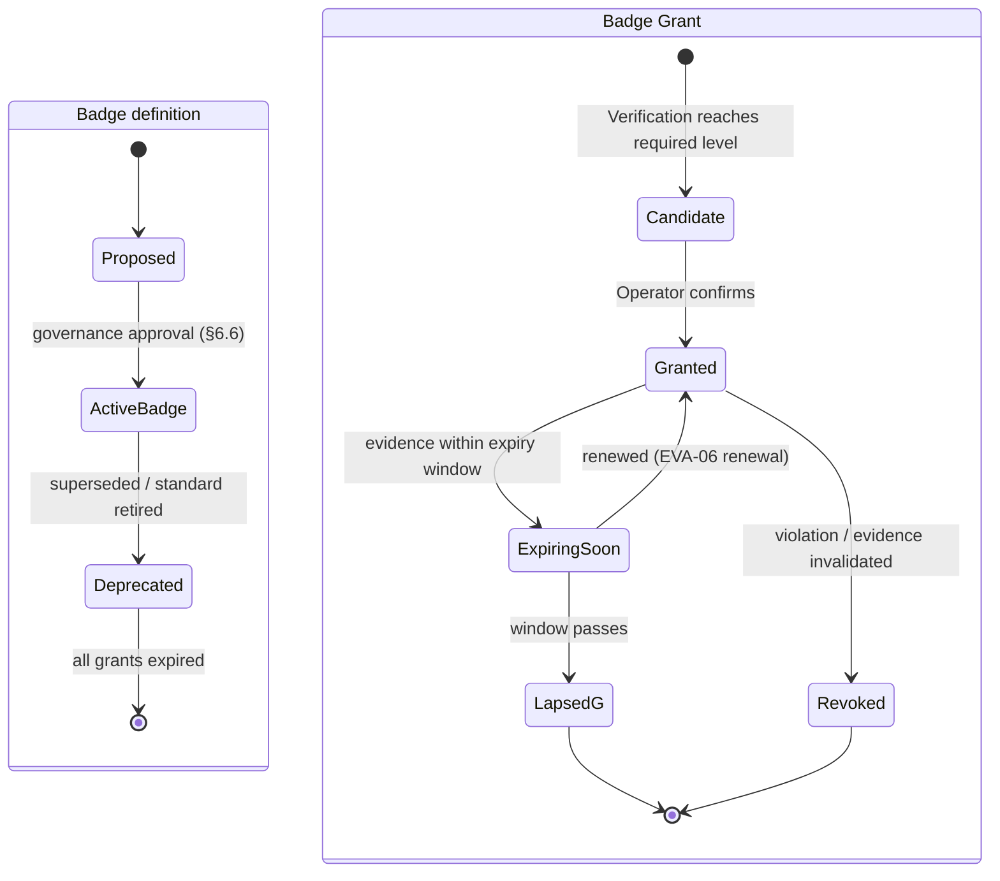

# Evergreen Badge System

| | |
|---|---|
| **Document ID** | EVA-05 |
| **Status** | Active |
| **Version** | 1.0.0 |
| **Owner** | Architecture Guild |
| **Last updated** | 2026-07-05 |

---

## 1. Purpose

Define the Badge system: the taxonomy, earning requirements, verification levels,
visual hierarchy, lifecycle, governance, and conflict rules for Evergreen's most
condensed trust signal. A Badge compresses a verified body of structured data into
one instantly readable mark — which is exactly why it is the most dangerous thing
Evergreen can get wrong. Badge integrity **is** platform integrity.

## 2. Scope

**In scope:** badge categories, requirements model, Verification Levels as applied
to badges, visual hierarchy rules, badge lifecycle, governance, conflict handling,
future badges.

**Out of scope:** evidence evaluation ([EVA-06](EVERGREEN_EVIDENCE_ENGINE.md)), the
Criteria content badges test against ([EVA-07](EVERGREEN_STANDARD_LIBRARY.md)),
visual design execution (Design System, Roadmap §3.4), badge display placement
([EVA-03 §6.2](EVERGREEN_INFORMATION_ARCHITECTURE.md)).

## 3. Dependencies

- [EVA-01 Knowledge System](EVERGREEN_KNOWLEDGE_SYSTEM.md) — terminology
  (Badge ≠ Certification: external attestations are Certifications, never Badges).
- [EVA-02 Product Architecture](EVERGREEN_PRODUCT_ARCHITECTURE.md) — trust flow;
  Verification lifecycle that badge grants follow.
- [EVA-07 Standard Library](EVERGREEN_STANDARD_LIBRARY.md) — every Badge is defined
  by exactly one Standard.
- [EVA-06 Evidence Engine](EVERGREEN_EVIDENCE_ENGINE.md) — Verification Levels and
  evidence evaluation feeding badge grants.

## 4. Related Documents

| Document | Relationship |
|---|---|
| [EVA-04 Product Schema §6.11](EVERGREEN_PRODUCT_SCHEMA.md) | Badge Grant fields stored on the Product Record |
| [EVA-03 Information Architecture](EVERGREEN_INFORMATION_ARCHITECTURE.md) | Badge pages, badge facets, one-click explanations |
| [EVA-09 API Concept](EVERGREEN_API_CONCEPT.md) | Badge data in APIs; embeddable badges (`Global`) |
| [Roadmap §3.9](../roadmap/EVERGREEN_MASTER_ROADMAP.md) | Badge domain phasing |

## 5. Definitions

This document owns: **Badge**, **Badge Grant**, **Badge Family**, and badge-specific
lifecycle/governance rules. **Verification Level** is owned by
[EVA-06](EVERGREEN_EVIDENCE_ENGINE.md) and applied here.

- **Badge** — a platform-defined trust mark, backed by exactly one Standard
  ([EVA-07](EVERGREEN_STANDARD_LIBRARY.md)), grantable to a Product Record or Brand.
- **Badge Grant** — the dated, level-tagged, expirable assignment of a Badge to a
  specific Product Record or Brand (fields:
  [EVA-04 §6.11](EVERGREEN_PRODUCT_SCHEMA.md)).
- **Badge Family** — a group of related badges sharing a theme (e.g., Packaging).

## 6. Architecture

### 6.1 Badge categories (families)

| Family | Grantee | Examples (target set) | First phase |
|---|---|---|---|
| **Verification** | Brand | *Verified Brand* (identity + baseline standards met) | MVP |
| **Transparency** | Product | *Full Ingredient Disclosure*, *Open Supply Chain* | MVP |
| **Ingredient** | Product | *Free of Restricted Substances*, *Fragrance-Free* | MVP |
| **Packaging** | Product | *Plastic-Free Packaging*, *Refillable* | MVP |
| **Environmental** | Product/Brand | *Verified Carbon Disclosure*, *Palm-Oil-Free* | V2 |
| **Social & Ethical** | Brand | *Cruelty-Free Practices*, *Living-Wage Disclosure* | V2 |

MVP launches with **3–6 badges maximum** (Roadmap §3.9) drawn from the first four
families. Scarcity is a feature: each badge must be explainable in one sentence.

### 6.2 Requirements model

Every Badge is defined by a triplet:

```
Badge = Standard (EVA-07) + minimum Verification Level (EVA-06) + grantee type
```

1. **One Standard per Badge.** The Standard's Criteria are the complete requirement
   set. No badge has "soft" or discretionary requirements.
2. **Minimum Verification Level.** Each badge declares the weakest level at which it
   may be granted (e.g., *Plastic-Free Packaging* requires at least
   `Evidence-Backed` from V2; MVP grants are `Reviewed` with the level displayed).
3. **Level is always displayed.** A badge never appears without its Verification
   Level; a `Declared`-level fact can never carry a badge (that would be a Claim,
   not a Badge — the fundamental distinction of the system).
4. **Public earning page.** Every badge has a badge page listing its Standard
   version, Criteria in plain language, Verification Level, and current grant count
   ([EVA-03 §6.2](EVERGREEN_INFORMATION_ARCHITECTURE.md)).

### 6.3 Verification Levels applied to badges

Levels are defined in [EVA-06](EVERGREEN_EVIDENCE_ENGINE.md); badge display encodes
them:

| Level | Badge display effect | Phase |
|---|---|---|
| `Declared` | **No badge possible** — shown as brand-declared Claim only | — |
| `Reviewed` | Badge with "reviewed by Evergreen" marker | MVP |
| `Evidence-Backed` | Badge with evidence marker; evidence summary linked | V2 |
| `Independently Audited` | Highest marker; auditor named on badge page | V3/Global |

### 6.4 Visual hierarchy

Design tokens live in the Design System; this document fixes the **rules**:

1. **At most 3 badges on a Product Card** (grid tile); the PDP shows all. Selection
   order: highest Verification Level first, then family priority
   (Verification → Transparency → Ingredient → Packaging → Environmental → Social).
2. **Uniform shape per family, uniform size per surface.** No badge is visually
   "louder" than another of the same level — importance is communicated by level
   markers, not decoration.
3. **Certifications display separately** from Badges (distinct visual language) so
   external marks and Evergreen marks are never conflated
  ([EVA-01 §7.1](EVERGREEN_KNOWLEDGE_SYSTEM.md)).
4. **Expired/lapsed badges are removed**, never greyed out — a faded badge still
   reads as endorsement at a glance.
5. Every rendered badge is a link to its badge page (one-click explanation rule).

### 6.5 Badge lifecycle

Two lifecycles exist: the **Badge definition** and each **Badge Grant**.



Rules:
- Grants follow the Verification lifecycle
  ([EVA-02 §6.7](EVERGREEN_PRODUCT_ARCHITECTURE.md)); a grant can never outlive its
  underlying evidence validity.
- **Revocation is public**: the badge page notes revocations (count, not pillory) —
  accountability without theater.
- Deprecating a badge definition never silently upgrades/downgrades products:
  existing grants run out their term; the badge page explains the deprecation.
- Standard version bumps ([EVA-07](EVERGREEN_STANDARD_LIBRARY.md)) define per-version
  grandfathering windows for existing grants.

### 6.6 Badge governance

| Rule | Detail |
|---|---|
| Creation | New badge = ADR + Standard published first (EVA-07 approval workflow) + badge page ready. No standard, no badge. |
| Ownership | Each Badge names an owning Operator role; interim: Architecture Guild |
| Cap discipline | Total active badges reviewed quarterly; target ≤ 12 until `V3` — badge inflation is treated as a defect |
| Commercial firewall | Badge grants and definitions are immune to commercial input; paid services never touch outcomes ([Roadmap §3.17](../roadmap/EVERGREEN_MASTER_ROADMAP.md)) |
| Naming | Plain, literal names; no superlatives ("Best", "Ultra") — names must survive legal claim review |
| Audit | Every grant/revocation is an audit-history event ([EVA-08](EVERGREEN_DATABASE_CONCEPT.md)) |

### 6.7 Badge conflicts

| Conflict type | Rule |
|---|---|
| **Mutually exclusive badges** | Declared pairwise in badge definitions (e.g., *Plastic-Free Packaging* excludes any packaging badge implying plastic use); grant-time check blocks both |
| **Badge vs. contradicting data** | A badge is auto-flagged for review if any Product Record field contradicts its Criteria after a data change (e.g., ingredient list edit vs. *Fragrance-Free*) — the material-change re-review of [EVA-02 §6.5](EVERGREEN_PRODUCT_ARCHITECTURE.md) |
| **Badge vs. Certification overlap** | Both may display; the badge page states how the external Certification contributed as Evidence (never "double counts" as an independent second proof from the same source) |
| **Cross-level confusion** | A Brand badge never implies product-level verification; PDP copy states grantee scope explicitly |
| **Dispute** | Brands can dispute a rejection/revocation through a documented process (V1+); disputes never suspend the public state while pending |

### 6.8 Future badges

Candidate families (each requires its Standard first; listed to reserve namespace,
not to promise):

- *Verified Refill Ecosystem* (packaging, V2) — refill relation §6.20 EVA-04 exists.
- *Full Carbon Transparency* (environmental, V3) — requires methodology maturity.
- *Supply-Chain Audited* (social, V3) — requires auditor network.
- *Longevity/Durability Verified* (lifecycle, Global) — category expansion beyond
  cosmetics.
- Market-specific regulatory badges (`Global`) — only where a market's law defines a
  mark Evergreen can verify against.

## 7. Risks

| Risk | Impact | Mitigation |
|---|---|---|
| Badge inflation | All badges devalue | Cap discipline §6.6; one-sentence explainability test |
| Legal exposure (badge read as guarantee) | Liability, trust collapse | Literal naming; level always displayed; claim review in legal gate |
| Gaming via data-edit after grant | Badges detach from truth | Contradiction auto-flag §6.7; material-change re-review |
| Level markers too subtle for users | `Reviewed` mistaken for audited | MVP user testing of level comprehension (Roadmap Phase 1 DoD) |
| Grandfathering disputes on standard bumps | Brand backlash | Per-version windows defined in the Standard itself (EVA-07) |

## 8. Future Evolution

- **V1:** grants via moderation workflow; dispute process.
- **V2:** evidence-derived grants with expiry automation; Environmental/Social
  families; revocation transparency counters.
- **V3:** `Independently Audited` level live; auditor registry.
- **Global:** embeddable off-platform badges — cryptographically signed, resolvable
  to the live grant state via the Public API ([EVA-09](EVERGREEN_API_CONCEPT.md));
  an off-platform badge whose grant lapsed renders as expired.

## 9. Open Questions

1. Final MVP badge set (3–6) — blocked on Standards v0 authoring (EVA-07) and the
   curated catalog's actual data coverage.
2. Should *Verified Brand* be a badge or a distinct UI state? (Leaning: badge, for
   uniform explanation machinery; the ✓ mark in the prototype becomes its rendering.)
3. Do lapsed badges leave a trace on the PDP ("held until 2027-03") or disappear
   entirely? Trade-off: honesty vs. reading as shaming. Default: disappear from PDP,
   history visible on badge page.
4. Embeddable badge anti-tamper design (signed SVG vs. iframe vs. API-rendered) —
   decide in `Global` planning with EVA-09.

## 10. Decision Log

| Date | Version | Change | Rationale |
|---|---|---|---|
| 2026-07-05 | 1.0.0 | Initial badge system | Fix badge semantics before Evidence Engine and Standards documents detail their inputs |

## 11. References

- [EVA-06 Evidence Engine](EVERGREEN_EVIDENCE_ENGINE.md) — Verification Levels
- [EVA-07 Standard Library](EVERGREEN_STANDARD_LIBRARY.md) — Standards behind badges
- [Roadmap §3.9](../roadmap/EVERGREEN_MASTER_ROADMAP.md)
