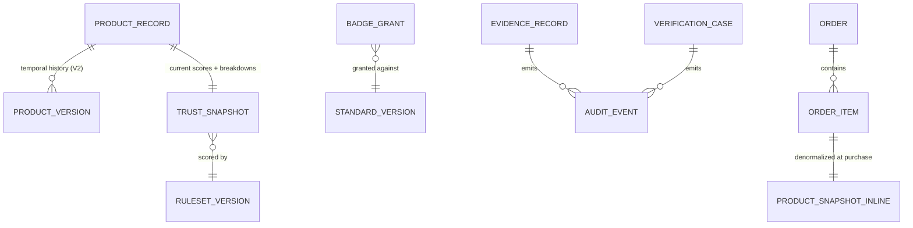

# Evergreen Database Concept

| | |
|---|---|
| **Document ID** | EVA-08 |
| **Status** | Active |
| **Version** | 1.0.0 |
| **Owner** | Architecture Guild |
| **Last updated** | 2026-07-05 |

---

## 1. Purpose

Define the **logical** data model of Evergreen: entities, relationships,
normalization philosophy, versioning, deletion semantics, audit history, search
strategy, and the scaling path. This is a conceptual document — deliberately **not
SQL**. The physical `MVP` implementation exists in the prototype
([schema.sql](../../backend/db/schema.sql)); this document is the target model that
physical schemas implement per phase.

## 2. Scope

**In scope:** logical entities and relations, data-integrity philosophy,
normalization/denormalization rules, temporal versioning, soft deletes, audit
history, search strategy, identifiers, scalability path.

**Out of scope:** physical DDL, index tuning, infrastructure sizing (Foundation
domain, Roadmap §3.1), field-level definitions
([EVA-04](EVERGREEN_PRODUCT_SCHEMA.md)), API serialization
([EVA-09](EVERGREEN_API_CONCEPT.md)).

## 3. Dependencies

- [EVA-02 Product Architecture](EVERGREEN_PRODUCT_ARCHITECTURE.md) — bounded
  contexts define storage ownership boundaries.
- [EVA-04 Product Schema](EVERGREEN_PRODUCT_SCHEMA.md) — the fields these entities
  carry.
- [EVA-06 Evidence Engine](EVERGREEN_EVIDENCE_ENGINE.md) /
  [EVA-07 Standard Library](EVERGREEN_STANDARD_LIBRARY.md) — versioned trust
  entities with special audit requirements.

## 4. Related Documents

| Document | Relationship |
|---|---|
| [Prototype schema.sql](../../backend/db/schema.sql) | Physical implementation of the MVP subset |
| [EVA-03 §6.4](EVERGREEN_INFORMATION_ARCHITECTURE.md) | Search philosophy this strategy serves |
| [EVA-09 API Concept](EVERGREEN_API_CONCEPT.md) | Reads/writes flowing through this model |
| [EVA-10 System Principles](EVERGREEN_SYSTEM_PRINCIPLES.md) | *Simple before Complex* governs the scaling path |

## 5. Definitions

This document owns: **Entity Group**, **Snapshot**, **Audit Event**, **Soft
Delete**, **Temporal Versioning** (as applied in Evergreen). Other terms:
[EVA-01 §7](EVERGREEN_KNOWLEDGE_SYSTEM.md#7-canonical-terminology-registry).

## 6. Architecture

### 6.1 Entity groups

Entities cluster by bounded context
([EVA-02 §6.2](EVERGREEN_PRODUCT_ARCHITECTURE.md)); each group has one writer
context — other contexts read.

| Group (context) | Entities | Notes |
|---|---|---|
| **Identity & Access** | User, Session, Role assignment | PII concentrated here by design (§6.8) |
| **Catalog** | Product Record, Brand, Manufacturer (V2), Category, Ingredient, Material (V1), Attribute, Certification, Media Asset (V1), Product Document (V1) | The public data backbone |
| **Trust** | Standard + Criterion (V2 as data), Claim (V2), Evidence Record (V1/V2), Verification case, Badge definition, Badge Grant, Scoring Rule Set | Highest audit requirements |
| **Commerce** | Order, Order Item, Payment record (V1), Inventory movement (V1) | Financial retention rules |
| **Intelligence** | Search index (derived), AI output cache (V1), Personalization profile (V3) | All rebuildable except profiles |
| **Platform Operations** | Audit Event log, Moderation case, Notification | Append-heavy |

### 6.2 Logical relationships

The core relations are defined in
[EVA-02 §6.3](EVERGREEN_PRODUCT_ARCHITECTURE.md) (entity overview) and
[EVA-04 §6.1](EVERGREEN_PRODUCT_SCHEMA.md) (product satellites); this document adds
the storage-relevant rules:

1. **Trust outputs are Snapshots.** Scores/breakdowns persist on the Product Record
   for read speed but are always recomputable; the snapshot stores the Rule Set /
   Standard version that produced it (invariant 5,
   [EVA-02 §6.4](EVERGREEN_PRODUCT_ARCHITECTURE.md)).
2. **Commerce denormalizes at write time.** Order Items embed name/price copies so
   financial history never depends on Catalog mutations (prototype precedent).
3. **Cross-context references are by ID only** — no cross-context foreign-key
   cascades that would couple lifecycles.

### 6.3 Normalization philosophy

| Data class | Approach | Rationale |
|---|---|---|
| Trust-bearing structured data (ingredients, claims, evidence links) | **Strictly normalized** | This data is queried, verified, audited at fine grain; duplication would fork truth |
| Read-path aggregates (scores, badge lists on cards, facet counts) | **Denormalized snapshots/caches** | Discovery surfaces must be fast at tens of millions of products; snapshots are disposable |
| Financial history | **Denormalized copies** | Immutability beats normalization for records-of-fact |
| Extensible data (Attributes §6.21 EVA-04) | Key-value with namespacing | Flexibility until promotion to typed fields |

Litmus test: *if two copies of a value could disagree, which one is the truth?* If
the answer isn't instant, the data must be normalized.

### 6.4 Identifiers

- **UUIDs** for all entity primary keys (prototype precedent): no coordination at
  scale, no enumeration leaks, safe cross-context references.
- **Slugs** as stable public identifiers for URL-addressable entities
  ([EVA-03 §6.5](EVERGREEN_INFORMATION_ARCHITECTURE.md)); slug history retained for
  redirects.
- **External identifiers** (GTIN, certificate numbers) stored as attributes with
  their issuing namespace, never as primary keys.

### 6.5 Temporal versioning

Evergreen must answer *"what did we assert on date X, and why?"* — a legal and
trust requirement, not a nice-to-have.

| Entity | Versioning approach | Phase |
|---|---|---|
| Product Record | **Version rows** on material change (the EVA-02 §6.5 re-review trigger); current row + history | V2 |
| Standards & Criteria | **Immutable versions** — published versions never mutate ([EVA-07 §6.2](EVERGREEN_STANDARD_LIBRARY.md)) | V2 |
| Scoring Rule Sets | Immutable rows; one active (prototype precedent) | MVP ⬥ |
| Evidence Records | Immutable after acceptance; lifecycle via status + Audit Events | V1 |
| Badge Grants | Append-only grant/lapse/revoke rows | V2 |
| Orders | Immutable after creation (status transitions only) | V1 |

Rule: **mutate presentation, never mutate history.** Anything that ever backed a
public trust statement is version-preserved.

### 6.6 Search strategy

Implements [EVA-03 §6.4](EVERGREEN_INFORMATION_ARCHITECTURE.md) philosophy:

| Phase | Approach | Trigger to advance |
|---|---|---|
| MVP–V1 | Database full-text search over structured fields (prototype: Postgres FTS + GIN) ⬥ | — |
| V2 | Same engine + materialized facet tables for count performance | facet queries degrade past ~100k products |
| V3+ | Dedicated search service (index derived 100% from the database; rebuildable) | catalog breadth + NL search requirements |

Invariants: the search index is **never a source of truth**; it can be dropped and
rebuilt from entities at any time. Ranking factors remain the documented
trust-first defaults regardless of engine.

### 6.7 Soft deletes

- **Nothing trust-relevant is hard-deleted.** Product Records archive
  ([EVA-02 §6.5](EVERGREEN_PRODUCT_ARCHITECTURE.md)); Brands offboard; Evidence
  expires/invalidates; Badges lapse/revoke — all as status transitions with
  history retained.
- Soft-deleted entities are excluded from all public queries by default (query-layer
  rule, not per-query discipline).
- **Two hard-delete exceptions:** (1) personal data under GDPR erasure — removed or
  anonymized while preserving non-personal record skeletons (e.g., Orders keep
  amounts, lose identity — [EVA-02 §6.8](EVERGREEN_PRODUCT_ARCHITECTURE.md));
  (2) illegal content, with the deletion itself logged as an Audit Event.

### 6.8 Audit history

- A single append-only **Audit Event** stream records every trust-relevant state
  change: `actor (user/system) · entity ref · action · before/after summary ·
  reason · timestamp`.
- Mandatory sources: verification decisions, badge grant/lapse/revoke, standard
  publications, moderation actions, brand suspension, scoring-rule activation,
  evidence invalidation, hard deletions.
- Audit Events are **write-once**: no update or delete path exists in the
  application; retention is indefinite for trust events (financial/PII events per
  legal retention schedules).
- The stream answers the Evidence-Engine cascade question ("what did this evidence
  ever support?" — [EVA-06 §6.7](EVERGREEN_EVIDENCE_ENGINE.md)) and feeds public
  transparency reports (Roadmap §3.7).
- PII discipline: Audit Events reference actors by ID; personal data lives only in
  Identity & Access so GDPR erasure never has to rewrite audit history.

### 6.9 Scalability path

Aligned with *Simple before Complex*
([EVA-10](EVERGREEN_SYSTEM_PRINCIPLES.md)) — one database until measurements demand
otherwise:

| Stage | Setup | Trigger |
|---|---|---|
| 1 (now) | Single PostgreSQL, app-level modules per context ⬥ | — |
| 2 | Read replicas for Discovery Surfaces; connection pooling | read latency SLO breach |
| 3 | Table partitioning (Audit Events by time; products by market in `Global`) | table-size operational pain |
| 4 | Context-level database separation (Trust and Commerce first candidates) | write contention or team-scale deploy conflicts |
| 5 | Dedicated stores where shape demands (search §6.6, object storage for evidence files — already S3 from V1) | per-workload evidence |

Explicit non-goals before `Global`: multi-master writes, event sourcing as system
of record, polyglot persistence for its own sake.

## 7. Risks

| Risk | Impact | Mitigation |
|---|---|---|
| Version/audit volume growth | Storage cost, slow queries | Partitioning stage 3; summaries for hot paths; history is cold data |
| Snapshot drift (stale scores) | Wrong public trust data | Rescore triggers (publish, rule change) + scheduled reconciliation job (V2) |
| GDPR erasure vs. audit immutability | Legal conflict | PII-by-reference discipline §6.8; erasure touches Identity store only |
| Premature distribution (stage 4 too early) | Ops complexity without benefit | Stage triggers are measured, not aspirational |
| Query-layer soft-delete rule bypassed | Archived data leaks into public | Central data-access layer owns the rule; raw-query review gate |

## 8. Future Evolution

- **V1:** Evidence Records + media in object storage; orders immutable; AI output
  cache.
- **V2:** product version rows, standards-as-data with immutable versions,
  materialized facets, reconciliation jobs.
- **V3:** personalization profile store with privacy-grade isolation; search
  service extraction (if triggered).
- **Global:** market partitioning, per-market retention schedules, cross-region
  read distribution.

## 9. Open Questions

1. Product version granularity in V2: full-row copies vs. field-level change
   records? (Leaning: full versions for simplicity + Audit Events for the diff
   narrative.)
2. Audit Event transport: database table only, or also an outbound event log for
   future integrations? (Default: table only until a consumer exists.)
3. Where does the AI output cache live once outputs must be auditable
   (EVA-06/EVA-09 interplay) — same audit stream or separate store?
4. Retention schedule specifics per jurisdiction — requires Legal (Roadmap §3.2)
   input before V1 orders.

## 10. Decision Log

| Date | Version | Change | Rationale |
|---|---|---|---|
| 2026-07-05 | 1.0.0 | Initial logical model | Persistence rules fixed before API design (EVA-09) |

## 11. References

- [Prototype schema.sql](../../backend/db/schema.sql) ⬥ marks implemented pieces
- [EVA-02](EVERGREEN_PRODUCT_ARCHITECTURE.md) · [EVA-04](EVERGREEN_PRODUCT_SCHEMA.md) · [EVA-06](EVERGREEN_EVIDENCE_ENGINE.md) · [EVA-07](EVERGREEN_STANDARD_LIBRARY.md)
- Kleppmann, *Designing Data-Intensive Applications* (versioning, audit patterns)
