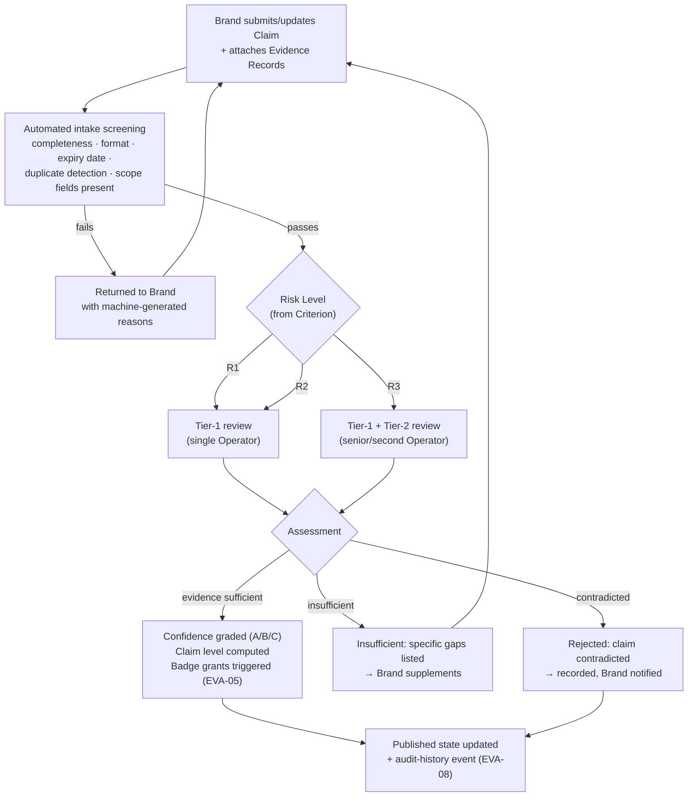
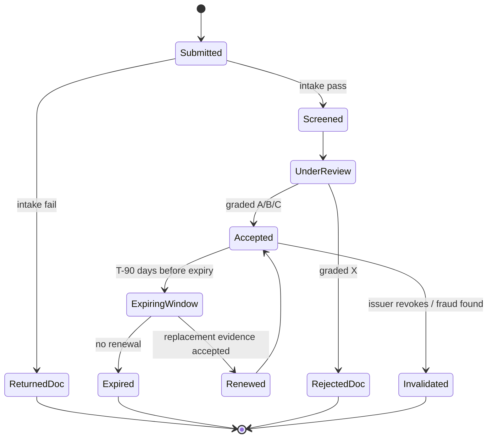

# Evergreen Evidence Engine

| | |
|---|---|
| **Document ID** | EVA-06 |
| **Status** | Active |
| **Version** | 1.0.0 |
| **Owner** | Architecture Guild |
| **Last updated** | 2026-07-05 |

---

## 1. Purpose

Define the Evidence Engine: how proof enters Evergreen, how it is typed, evaluated,
graded, linked to Claims and Badges, and how it ages and expires. The Evidence
Engine is what turns Evergreen from "a site that says things" into "a system that
can show *why* it says things" — the operational heart of *Evidence over Claims*
([EVA-10](EVERGREEN_SYSTEM_PRINCIPLES.md)).

Per the [Roadmap §3.10](../roadmap/EVERGREEN_MASTER_ROADMAP.md), the engine is
**paper-designed now, built from V1 (upload + human review) and completed in V2**.
This document is that paper design.

## 2. Scope

**In scope:** accepted evidence types, Verification Levels, Confidence Levels, the
verification workflow, document lifecycle, expiration policy, review process, risk
levels, dispute handling hooks.

**Out of scope:** the Criteria evidence is evaluated against
([EVA-07](EVERGREEN_STANDARD_LIBRARY.md)), badge display effects
([EVA-05](EVERGREEN_BADGE_SYSTEM.md)), storage design
([EVA-08](EVERGREEN_DATABASE_CONCEPT.md)), reviewer staffing/SOPs (Operations,
Roadmap §3.13).

## 3. Dependencies

- [EVA-01 Knowledge System](EVERGREEN_KNOWLEDGE_SYSTEM.md) — terminology.
- [EVA-02 Product Architecture §6.7](EVERGREEN_PRODUCT_ARCHITECTURE.md) — the
  Verification lifecycle this engine operates.
- [EVA-04 Product Schema §6.9–6.10](EVERGREEN_PRODUCT_SCHEMA.md) — the Claim and
  provenance fields evidence attaches to.
- [EVA-07 Standard Library](EVERGREEN_STANDARD_LIBRARY.md) — Criteria define what
  evidence must demonstrate.

## 4. Related Documents

| Document | Relationship |
|---|---|
| [EVA-05 Badge System](EVERGREEN_BADGE_SYSTEM.md) | Consumes Verification Levels for badge grants |
| [EVA-08 Database Concept](EVERGREEN_DATABASE_CONCEPT.md) | Persists Evidence Records, audit history |
| [EVA-09 API Concept](EVERGREEN_API_CONCEPT.md) | Evidence submission via Brand Portal APIs |
| [Roadmap §3.10](../roadmap/EVERGREEN_MASTER_ROADMAP.md) | Phasing and operational context |

## 5. Definitions

This document owns: **Evidence Record**, **Evidence Type**, **Verification Level**,
**Confidence Level**, **Risk Level**, **Review Tier**. Other terms:
[EVA-01 §7](EVERGREEN_KNOWLEDGE_SYSTEM.md#7-canonical-terminology-registry).

## 6. Architecture

### 6.1 Evidence types (accepted evidence)

| Type | Description | Inherent strength | Typical expiry |
|---|---|---|---|
| **External Certification document** | Certificate issued by a recognized scheme (COSMOS, Leaping Bunny, GOTS…) | High | Certificate's own validity date |
| **Lab report** | Analytical result from an identified laboratory (ISO 17025 preferred) | High | 24 months, or batch-bound |
| **Independent audit report** | On-site audit by an accredited third party | Highest | Per audit cycle (12–36 months) |
| **Supplier declaration** | Upstream supplier attests a property (e.g., RSPO palm source) | Medium | 12 months |
| **Manufacturer statement** | Formal signed statement by the Manufacturer | Medium-low | 12 months |
| **Brand declaration** | The Brand's own structured assertion | Lowest (= `Declared`) | Until contradicted or data changes |
| **Registry lookup** | Machine-checkable public registry (certification databases, company registers) | High (verifiable) | Re-check interval per registry |
| **Public regulatory filing** | Official filings (safety assessments, notifications) | High | Filing-dependent |

Rules:
1. Every Evidence Record carries: type, issuer identity, issue date, expiry date,
   scope (which products/claims it covers), file/reference, confidentiality tier,
   and its assigned Confidence Level (§6.3).
2. **Scope discipline:** evidence covers exactly what it names. A facility audit is
   Brand/Manufacturer-scope; it never silently verifies a product-level claim.
3. **Confidentiality tiers:** `public` (document downloadable), `summary`
   (public metadata + Operator-verified summary, file private), `private`
   (existence disclosed, content restricted). Default: `summary` — existence of
   evidence is always public, contents may be protected.
4. The MVP-era free-text `data_sources`
   ([EVA-04 §6.9](EVERGREEN_PRODUCT_SCHEMA.md)) maps to `Brand declaration` when
   migrated in V2.

### 6.2 Verification Levels

The strength tier of a verified fact — displayed platform-wide (badges, PDP,
API):

| Level | Meaning | Minimum evidence |
|---|---|---|
| **Declared** | Brand asserts it; Evergreen has not evaluated it | Brand declaration |
| **Reviewed** | An Operator has checked the assertion for plausibility and internal consistency | Brand declaration + Operator review |
| **Evidence-Backed** | Assertion is supported by at least one accepted, current, in-scope Evidence Record of medium+ strength | Per Criterion (EVA-07) |
| **Independently Audited** | Verified through third-party audit or Evergreen-commissioned testing | Audit report / commissioned lab report |

Level assignment is per **Claim**, computed from the weakest link: a claim's level
is the level its *worst necessary* evidence supports. Levels never average.

### 6.3 Confidence Levels

Reviewer-assigned reliability grade of a **single Evidence Record** (orthogonal to
Verification Level, which grades a *Claim*):

| Confidence | Criteria (all must hold for the grade) |
|---|---|
| **A — Strong** | Issuer independently verifiable · document authentic (checked via registry/issuer) · in scope · current |
| **B — Adequate** | Issuer identified and plausible · no authenticity flags · in scope · current |
| **C — Weak** | Self-issued or unverifiable issuer, or scope partially matching |
| **X — Rejected** | Inauthentic, out of scope, expired at submission, or contradicted |

Only A/B evidence can raise a claim to `Evidence-Backed`. C-grade evidence is
retained (it is still information) but displayed as supporting context only.

### 6.4 Risk Levels

Risk classification decides **review depth** — scarce reviewer time goes where
being wrong hurts most:

| Risk | Definition | Examples | Review requirement |
|---|---|---|---|
| **R3 — High** | Health-adjacent or legally sensitive claims | allergen-free, restricted-substance-free, SPF, "safe for…" | Tier-2 review mandatory (§6.6); A-grade evidence only |
| **R2 — Medium** | Material trust claims | plastic-free, vegan, palm-oil-free, origin | Tier-1 review; A/B evidence |
| **R1 — Low** | Descriptive/verifiable-by-inspection | packaging type, refillable | Tier-1 spot-check |

Risk level is defined per Criterion in the Standard
([EVA-07](EVERGREEN_STANDARD_LIBRARY.md)), not improvised per review.

### 6.5 Verification workflow

Workflow rules:
1. **Automation screens, humans decide** (*Human Review before Automation*,
   [EVA-10](EVERGREEN_SYSTEM_PRINCIPLES.md)). Intake screening may *reject for
   form*; only Operators accept or reject *for substance*. Machine assistance
   (OCR, registry lookups, summary drafts) is advisory and labeled.
2. **Reasons are mandatory.** Every non-acceptance carries specific, actionable
   reasons; "rejected" without a why is a process defect.
3. **Reviewer independence:** a Tier-2 reviewer must not be the Tier-1 reviewer of
   the same case.
4. Every state change emits an audit event with actor, timestamp, and reason
   ([EVA-08](EVERGREEN_DATABASE_CONCEPT.md)).

### 6.6 Review process & tiers

| Tier | Who | Handles | Authority |
|---|---|---|---|
| **Tier 1** | Trained Operator | R1/R2 cases, intake escalations | Grade evidence, set claim levels up to `Evidence-Backed` |
| **Tier 2** | Senior Operator / domain expert | All R3, disputes, precedent-setting cases | Everything, incl. revocations and `Independently Audited` confirmations |
| **Escalation** | Architecture Guild + legal | Novel claim types, standard ambiguities | May trigger a Standard change (EVA-07) instead of an ad-hoc ruling |

Consistency mechanisms: written decision guidelines per Criterion (EVA-07 includes
an *evidence requirements* section per Criterion); periodic cross-review sampling
(Tier-2 re-reviews a random sample of Tier-1 decisions); all precedents logged.

### 6.7 Document lifecycle & expiration

Expiration policy:
- Every Evidence Record has an expiry (§6.1 defaults; the document's own validity
  wins when shorter).
- **T-90/T-30/T-7** notifications to the Brand before expiry (V2 automation).
- Expiry cascades: expired evidence → affected Claims recompute levels → Badge
  grants follow the `Expiring → Lapsed` path
  ([EVA-05 §6.5](EVERGREEN_BADGE_SYSTEM.md)) → public state degrades to `Declared`.
  Nothing is deleted; the record remains in history as `Expired`.
- **Invalidation is retroactive-safe:** if evidence is found fraudulent, all claims
  and badges that relied on it are re-evaluated immediately (audit history answers
  "what did this evidence ever support?" — [EVA-08](EVERGREEN_DATABASE_CONCEPT.md)).

## 7. Risks

| Risk | Impact | Mitigation |
|---|---|---|
| Forged/manipulated documents | False verified states | Registry cross-checks, issuer verification for A-grade, invalidation cascade §6.7 |
| Reviewer bottleneck at catalog scale | Verification backlog kills supply growth | Risk-tiered depth §6.4; machine-assisted screening; ops hiring trigger (Roadmap §3.13) |
| Inconsistent grading between Operators | Arbitrary-feeling outcomes | Per-Criterion guidelines, cross-review sampling §6.6 |
| Confidential document leakage | Brand trust destroyed, legal exposure | Confidentiality tiers §6.1-3, access controls + audit (EVA-08), security program (Roadmap §3.14) |
| Evidence theater (volume over substance) | High-effort, low-truth submissions | Scope discipline §6.1-2; levels computed from weakest link §6.2 |

## 8. Future Evolution

- **V1:** evidence upload in Brand Portal; manual review; levels displayed.
- **V2:** full engine — typed records, expiry automation, cascades, registry
  lookups, reviewer assistance (OCR/summaries, advisory-only).
- **V3:** `Independently Audited` operational (auditor network); Evergreen-
  commissioned spot lab-testing program for R3 claims.
- **Global:** external auditor API access; per-market evidence requirements;
  machine-verifiable evidence formats (signed digital certificates) preferred
  intake.

## 9. Open Questions

1. Which certification registries expose machine-checkable APIs (COSMOS, RSPO,
   Leaping Bunny…) — determines how much of A-grade checking can be assisted early.
2. Evidence retention duration after expiry/brand offboarding (legal + storage
   trade-off; interacts with GDPR for personal data inside documents).
3. Should Evergreen commission random verification testing (mystery-shopper lab
   tests) from V2 already, budget permitting? Strong trust signal, real cost.
4. Dispute process SLA and whether disputes are public (leaning: process public,
   individual disputes private until resolved — consistent with EVA-05 §6.7).

## 10. Decision Log

| Date | Version | Change | Rationale |
|---|---|---|---|
| 2026-07-05 | 1.0.0 | Initial engine design | Paper design mandated by Roadmap §3.10 before any V1/V2 build |

## 11. References

- [EVA-02 §6.7](EVERGREEN_PRODUCT_ARCHITECTURE.md) — Verification lifecycle
- [EVA-05](EVERGREEN_BADGE_SYSTEM.md) · [EVA-07](EVERGREEN_STANDARD_LIBRARY.md) · [EVA-08](EVERGREEN_DATABASE_CONCEPT.md)
- ISO/IEC 17025 (laboratory competence) — referenced for lab-report grading
