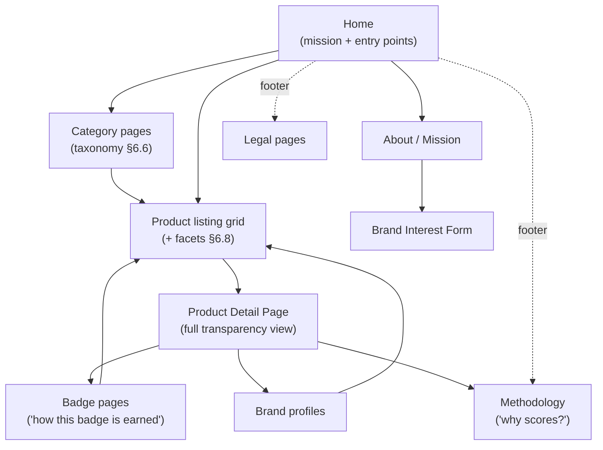

# Evergreen Information Architecture

| | |
|---|---|
| **Document ID** | EVA-03 |
| **Status** | Active |
| **Version** | 1.0.0 |
| **Owner** | Architecture Guild |
| **Last updated** | 2026-07-05 |

---

## 1. Purpose

Define how information is organized, navigated, searched, and discovered on
Evergreen's consumer surfaces. The information architecture must make **trust
legible**: a Shopper should always know *where they are*, *what they are looking
at*, *how verified it is*, and *what is unknown* — without training.

## 2. Scope

**In scope:** navigation model, user journeys, information hierarchy, search
philosophy, discoverability, product browsing, taxonomy structure and governance,
breadcrumbs, filtering philosophy.

**Out of scope:** visual design (Design System, Roadmap §3.4), field-level data
([EVA-04](EVERGREEN_PRODUCT_SCHEMA.md)), search infrastructure
([EVA-08 §6.6](EVERGREEN_DATABASE_CONCEPT.md)), Brand Portal / Operations Console
internal IA (documented with those applications when they leave dormancy).

## 3. Dependencies

- [EVA-01 Knowledge System](EVERGREEN_KNOWLEDGE_SYSTEM.md) — terminology.
- [EVA-02 Product Architecture](EVERGREEN_PRODUCT_ARCHITECTURE.md) — entities and
  lifecycles surfaced by this IA; Intelligence layer boundary (search is read-only).
- [Roadmap §4](../roadmap/EVERGREEN_MASTER_ROADMAP.md) — MVP priority map (which
  surfaces exist per phase).

## 4. Related Documents

| Document | Relationship |
|---|---|
| [EVA-04 Product Schema](EVERGREEN_PRODUCT_SCHEMA.md) | Source of the structured fields that power filters and facets |
| [EVA-05 Badge System](EVERGREEN_BADGE_SYSTEM.md) | Badges as navigation/filter dimensions and their display rules |
| [EVA-09 API Concept](EVERGREEN_API_CONCEPT.md) | Public API mirrors this IA's resource structure |
| [EVA-10 System Principles](EVERGREEN_SYSTEM_PRINCIPLES.md) | *Transparency over Marketing*, *Honest Unknown* applied to UX |

## 5. Definitions

This document owns: **Taxonomy** (the Category tree and its governance), **Facet**,
**Discovery Surface**, **Trust-first ranking**. All other terms:
[EVA-01 §7](EVERGREEN_KNOWLEDGE_SYSTEM.md#7-canonical-terminology-registry).

- **Facet** — a filterable dimension derived from structured Product Record data
  (never from marketing copy).
- **Discovery Surface** — any page whose job is finding products: home, category
  pages, search results, badge pages, brand profiles.
- **Trust-first ranking** — Evergreen's default ordering: relevance first, then
  Trust Signals; never pay-for-position.

## 6. Architecture

### 6.1 Information hierarchy

The consumer site is organized around four top-level information types, in strict
priority order — this order resolves layout and navigation conflicts:

| Priority | Information type | Rationale |
|---|---|---|
| 1 | **Trust information** (scores, badges, evidence status, unknowns) | The product of the platform |
| 2 | **Product facts** (structured fields: ingredients, packaging, origin) | The substance behind trust |
| 3 | **Discovery aids** (categories, search, filters, comparisons) | Path to products |
| 4 | **Commerce information** (price, stock, checkout) | Consequence, not lead |

Rule: on any surface, no Priority-4 element may visually dominate a Priority-1
element (enforced through Design System patterns).

### 6.2 Navigation model

Global navigation (persistent header) carries at most: **Browse** (taxonomy entry),
**Search**, **About**, and account/cart entries in the phases where they exist
([Roadmap §4](../roadmap/EVERGREEN_MASTER_ROADMAP.md)). Trust-explaining pages
(Methodology, Badge pages) are always reachable within one click from any Trust
Signal — a score or badge is never displayed without a path to its explanation
(Trust flow step 6, [EVA-02 §6.4](EVERGREEN_PRODUCT_ARCHITECTURE.md)).

### 6.3 User journeys

Canonical journeys the IA must serve (personas per
[EVA-01 §7.3](EVERGREEN_KNOWLEDGE_SYSTEM.md)):

| Journey | Actor | Path | Success criterion |
|---|---|---|---|
| **Discover** | Shopper | Home → Category → Grid → PDP | Finds a trustworthy product in ≤ 4 interactions |
| **Scrutinize** | Skeptical Shopper | PDP → Score Breakdown → Badge page → Methodology | Can audit any Trust Signal without leaving the site |
| **Compare** | Shopper | Grid/PDP → Comparison (placeholder in MVP, full in V3) | Sees structured differences, incl. unknowns |
| **Check compatibility** | Profiled Shopper (V3) | Any PDP → personal compatibility indicators | Sees own-allergen conflicts instantly |
| **Apply** | Brand User | About/Home → Brand Interest Form | Submits qualified interest in ≤ 5 minutes |
| **Verify a claim** | Operator | Operations Console queues (out of scope here; EVA-06) | — |

Journey rule: every journey must be completable **anonymously** except those that
inherently require identity (checkout, profiles). Trust information is never gated
behind registration.

### 6.4 Search philosophy

1. **Structured-first.** Search operates on structured fields (name, brand,
   category, ingredients, badges) — not on marketing prose. A query for
   "aloe" matches products *containing* aloe as an Ingredient before products
   *mentioning* aloe in a description.
2. **Honest results.** No sponsored injection, no synonym-stretching to inflate
   result counts. Zero results is an honest answer and shows the nearest
   structured alternatives (category, related badges).
3. **Trust-first ranking.** Default order: text relevance → Transparency Score →
   Sustainability Score as tie-breakers. Users can re-sort; the default is never
   commercial. Ranking factors are publicly documented on the Methodology page —
   ranking is itself a Trust Signal.
4. **Unknowns don't vanish.** Products with incomplete data appear in results with
   their honest scores; hiding them would create a false impression of the catalog.
5. **Phase discipline.** `MVP/V1`: database full-text search (prototype precedent).
   Dedicated search infrastructure only at the scale trigger defined in
   [EVA-08 §6.6](EVERGREEN_DATABASE_CONCEPT.md).

### 6.5 Discoverability

- **Every entity gets a stable, human-readable URL** (slug-based; see EVA-04
  identity fields): products, brands, categories, badges, standards (V2+). URLs are
  permanent; renames leave redirects.
- **Discovery Surfaces are interlinked:** a PDP links to its Category, Brand, each
  Badge, and each Certification; each of those links back to a filtered Grid.
  There are no dead-end pages.
- **SEO as honest byproduct:** structured data (schema.org Product markup derived
  from the Product Record) exposes the same facts shown on-page — never enhanced
  claims (Growth Engine, Roadmap §3.16).
- **AI discoverability:** the same structured facts back AI-readable outputs via the
  Public API ([EVA-09](EVERGREEN_API_CONCEPT.md)); Evergreen treats AI agents as a
  first-class discovery channel from `V3`.

### 6.6 Taxonomy

Structure:

- A single **Category tree**, max depth 3 (`Domain → Category → Subcategory`),
  e.g. `Personal Care → Skincare → Serums`.
- Every Product Record belongs to **exactly one primary Category** (stable
  breadcrumb, unambiguous counts) and may carry additional **cross-cutting
  dimensions** (badges, sustainability attributes) that act as virtual collections —
  these are facets, not categories.
- Category nodes carry: name, slug, description, parent, phase-of-introduction,
  and status (`active/merged/retired`).

Governance:

| Rule | Detail |
|---|---|
| Ownership | Operators manage the tree (Roadmap §3.13); changes logged in audit history |
| Stability | Categories are renamed/merged, never hard-deleted; slugs redirect |
| Growth trigger | New Subcategory only when ≥ ~20 products would populate it; premature splitting fragments discovery |
| Localization | Category names localize (`Global`); slugs remain canonical English |
| Expansion | New Domains (e.g., `Food`, `Household`) follow the Roadmap §3.18 category-expansion decision |

### 6.7 Breadcrumbs

- Every page below Home shows a breadcrumb reflecting the **primary hierarchy**:
  `Home › Personal Care › Skincare › Serums › Calendula Repair Serum`.
- Breadcrumbs always reflect the taxonomy, never the visitor's click path
  (filter states are not breadcrumb nodes — they live in the URL query).
- Badge pages and Brand profiles breadcrumb to their own roots
  (`Home › Badges › …`, `Home › Brands › …`).
- Breadcrumbs are machine-readable (schema.org BreadcrumbList) for §6.5.

### 6.8 Filtering philosophy

Filters are Evergreen's most direct expression of *structured data over marketing*:

1. **Facets come from the schema.** Every filter maps 1:1 to a structured field or
   relation in [EVA-04](EVERGREEN_PRODUCT_SCHEMA.md): Category, Badge,
   Certification, price, packaging attributes, sustainability attributes,
   Ingredient exclusions ("without fragrance"), origin, and score thresholds.
2. **Honest counts.** Every facet value shows its true result count; zero-count
   values are visible but disabled — the catalog's gaps are information, not
   embarrassment.
3. **Three-state logic where unknowns exist.** Boolean facets with unknown data
   filter as `yes / no / unknown` — filtering "recyclable packaging: yes" excludes
   `unknown`, and the UI states this explicitly ("12 products excluded because
   recyclability is unknown"). Unknowns are never silently folded into "no".
4. **Exclusion filters are first-class** (`V3` full, placeholder earlier): avoiding
   an ingredient is a more trust-critical act than finding one.
5. **No dark-pattern filters.** No "deal" facets, no urgency facets, no defaults
   that pre-narrow to commercially preferred subsets.
6. **Score-threshold filters** (min Transparency/Sustainability, prototype
   precedent) always link to the Methodology page explaining what the scores mean.

## 7. Risks

| Risk | Impact | Mitigation |
|---|---|---|
| Taxonomy sprawl as catalog grows | Fragmented discovery, thin categories | Growth trigger rule §6.6; quarterly taxonomy review |
| Filter overload on small catalogs | Empty result states dominate | Phase-gate facets: MVP ships ≤ 6 facets; add with catalog density |
| Trust info buried by commerce UI pressure | Violates hierarchy §6.1 | Priority order is a review gate for any new surface |
| Unknown-state UX confusing shoppers | Misreads honesty as brokenness | Three-state pattern with explicit exclusion messaging §6.8-3; user-test in MVP DoD (Roadmap) |
| URL/slug churn breaking links & SEO | Lost discoverability | Permanent slugs + redirect rule §6.5 |

## 8. Future Evolution

- **V1:** brand profiles enriched; facet set grows with real catalog density.
- **V2:** badge pages become evidence-aware ("earned by N products, M
  evidence-backed"); standards get public URLs.
- **V3:** personal compatibility indicators on all Discovery Surfaces; full
  comparison; exclusion filters complete; AI-assisted natural-language search
  (grounded, per EVA-02 Intelligence rules).
- **Global:** localized taxonomy labels, per-market catalogs, market-aware URLs
  under one canonical structure.

## 9. Open Questions

1. Category tree v1 for MVP launch (how many of the 3 prototype categories expand,
   and into what Domains) — needs the curated-catalog decision from Roadmap §5-1.
2. Should badge pages aggregate cross-category ("all Plastic-Free products") in MVP
   or V1? (Leaning: MVP — cheap and high trust value.)
3. Do score-threshold filters confuse more than help before the Methodology page has
   been user-tested? (Ship behind the MVP interview loop, Roadmap §2 Phase 1 DoD.)

## 10. Decision Log

| Date | Version | Change | Rationale |
|---|---|---|---|
| 2026-07-05 | 1.0.0 | Initial version | Fix IA before schema/badge docs cement the field inventory |

## 11. References

- [EVA-01 Knowledge System](EVERGREEN_KNOWLEDGE_SYSTEM.md)
- [EVA-02 Product Architecture](EVERGREEN_PRODUCT_ARCHITECTURE.md)
- [Roadmap](../roadmap/EVERGREEN_MASTER_ROADMAP.md) §4 (MVP priorities), §3.5, §3.16
- schema.org Product / BreadcrumbList vocabularies
