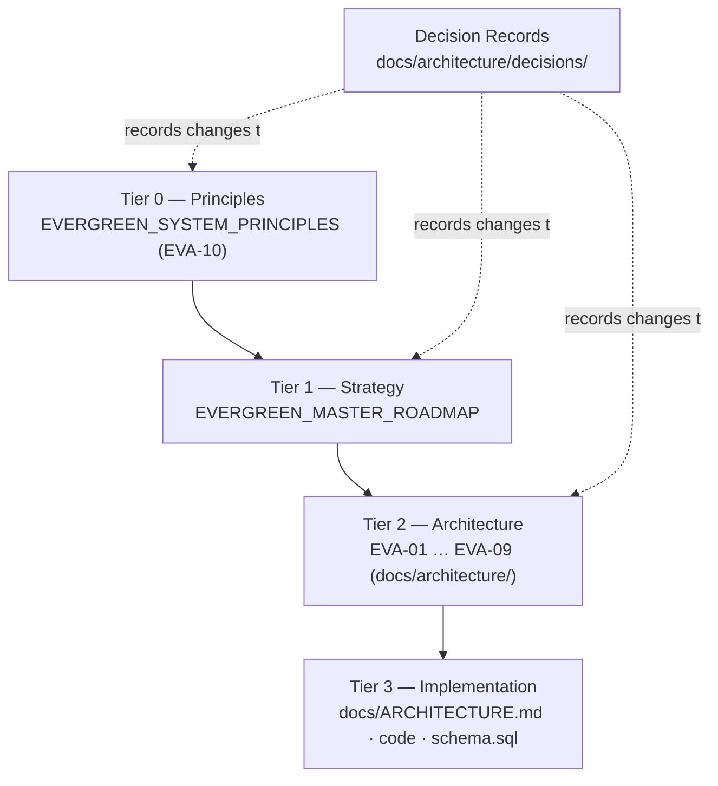

# Evergreen Knowledge System

| | |
|---|---|
| **Document ID** | EVA-01 |
| **Status** | Active |
| **Version** | 1.0.1 |
| **Owner** | Architecture Guild (interim: founding team) |
| **Last updated** | 2026-07-05 |

---

## 1. Purpose

Define how knowledge is created, structured, owned, versioned, reviewed, and kept
consistent across Project Evergreen. Evergreen's product **is** trustworthy
information; the organization that builds it must therefore hold its own internal
information to the same standard it applies to product data: sourced, structured,
explainable, and honest about gaps.

This document is the **governance root** of the architecture documentation set. Every
other architecture document (EVA-02 … EVA-10) conforms to the rules defined here.

## 2. Scope

**In scope:** documentation philosophy, source-of-truth rules, document hierarchy,
versioning, ownership, Architecture Decision Records (ADRs), governance, writing
standards, review process, and the Canonical Terminology Registry.

**Out of scope:** the content of the individual architecture domains (see the
respective EVA documents), product/legal copy standards (Brand Identity domain,
[Roadmap §3.3](../roadmap/EVERGREEN_MASTER_ROADMAP.md)), and end-user documentation.

## 3. Dependencies

- [EVERGREEN_MASTER_ROADMAP](../roadmap/EVERGREEN_MASTER_ROADMAP.md) — strategic
  phasing (MVP → V1 → V2 → V3 → Global) and the 18 core domains. This roadmap is the
  **source of truth for phasing and scope**; architecture documents never redefine
  phase boundaries.
- [docs/ARCHITECTURE.md](../ARCHITECTURE.md) — the **implementation record** of the
  current prototype. It describes *what exists*; EVA documents describe *what is
  designed*. Where they diverge, EVA documents state the target and reference the
  prototype as "current implementation".

## 4. Related Documents

| Document | Relationship |
|---|---|
| [EVERGREEN_SYSTEM_PRINCIPLES](EVERGREEN_SYSTEM_PRINCIPLES.md) (EVA-10) | Tier-0 principles this governance enforces (e.g., Documentation First) |
| [EVERGREEN_PRODUCT_ARCHITECTURE](EVERGREEN_PRODUCT_ARCHITECTURE.md) (EVA-02) | First consumer of these rules |
| [Architecture Index](README.md) | Navigable map of all EVA documents |
| [Roadmap](../roadmap/EVERGREEN_MASTER_ROADMAP.md) | Tier-1 strategy layer above this document set |

## 5. Definitions

Terms used across all EVA documents are defined once, in §7 (Canonical Terminology
Registry). Local sections named "Definitions" in other documents may only define
concepts **owned by that document**, and must link here for everything else.

## 6. Architecture

### 6.1 Documentation philosophy

1. **Docs-as-code.** All architecture knowledge lives in this repository, in Markdown,
   versioned by Git, changed via commits and reviewed via pull requests. No knowledge
   of architectural relevance may live only in chat threads, decks, or heads.
2. **Single source of truth.** Every concept is defined in exactly one document — its
   *owning document*. All other documents link to it. Duplication is a defect.
3. **Knowledge graph, not book.** Documents are nodes; cross-references are edges.
   A reader (human or AI agent) must be able to start anywhere and reach any related
   concept through explicit links.
4. **Honest Unknown applies internally.** Open questions are stated as open questions
   (every document has an *Open Questions* section). We never paper over an undecided
   point with confident prose — the same rule Evergreen applies to product data.
5. **Written for successors.** The audience is a competent engineer or AI coding
   agent joining in year 3 with zero context. If a decision's *why* is not written,
   the decision does not exist.

### 6.2 Document hierarchy (tiers)



| Tier | Contents | Changes when | Authority |
|---|---|---|---|
| **0 — Principles** | System principles (EVA-10) | Rarely; founder-level decision | Overrides everything |
| **1 — Strategy** | Master Roadmap (phases, domains, priorities) | Quarterly review | Overrides Tier 2/3 |
| **2 — Architecture** | EVA-01 … EVA-09 | Per ADR | Overrides Tier 3 |
| **3 — Implementation** | Prototype architecture record, code, schemas | Continuously | Must conform upward |

**Conflict rule:** the higher tier wins. A lower-tier document that contradicts a
higher tier is a bug and must be fixed in the same change that discovers it.
**Precedence within a tier:** the document that *owns* the concept (per §6.3) wins.

### 6.3 Concept ownership map

Each concept has exactly one owning document. The full registry lives in the
[Architecture Index](README.md); the anchor assignments are:

| Concept family | Owning document |
|---|---|
| Terminology, documentation rules, ADRs | EVA-01 (this document) |
| Platform layers, domain boundaries, lifecycles | EVA-02 Product Architecture |
| Navigation, taxonomy (structure), search & filtering philosophy | EVA-03 Information Architecture |
| Product Record fields and sub-entities | EVA-04 Product Schema |
| Badges (types, levels, lifecycle, governance) | EVA-05 Badge System |
| Evidence Records, verification workflow, confidence | EVA-06 Evidence Engine |
| Standards, Criteria, standards governance | EVA-07 Standard Library |
| Logical data model, versioning/audit strategy | EVA-08 Database Concept |
| API surfaces, authn/z, rate limits, API versioning | EVA-09 API Concept |
| Architectural principles and decision tests | EVA-10 System Principles |

### 6.4 Versioning

- Every document carries a **semantic version** in its header table:
  - **MAJOR** — a breaking conceptual change (a concept redefined, a lifecycle
    restructured). Requires an ADR.
  - **MINOR** — additive content (new section, new fields, new diagrams).
  - **PATCH** — corrections, wording, link fixes.
- Every MAJOR/MINOR change appends a row to the document's **Decision Log** (§ at the
  end of each document) with date, change, and rationale/ADR link.
- Git history is the full audit trail; the Decision Log is the human-readable summary.
- Documents are never deleted. A superseded document gets `Status: Superseded` and a
  link to its successor.

### 6.5 Ownership

- Every document names an **Owner** in its header. The owner is accountable for
  accuracy, consistency, and review response — not the sole author.
- Until dedicated roles exist, the founding team acts as the **Architecture Guild**
  (interim owner of all EVA documents). As the organization grows, ownership moves to
  the domain teams defined in [Roadmap §3](../roadmap/EVERGREEN_MASTER_ROADMAP.md).
- An unowned document is treated as stale and must be re-assigned before it may be
  cited in new work.

### 6.6 Architecture Decision Records (ADRs)

Significant decisions are recorded as ADRs in `docs/architecture/decisions/`,
numbered sequentially (`ADR-0001-title.md`). "Significant" = expensive to reverse,
cross-domain, or precedent-setting (see the Reversible Decisions principle,
[EVA-10](EVERGREEN_SYSTEM_PRINCIPLES.md)).

**ADR template (canonical):**

```markdown
# ADR-NNNN: <Title>

- Status: Proposed | Accepted | Superseded by ADR-MMMM
- Date: YYYY-MM-DD
- Deciders: <names/roles>
- Affected documents: <EVA-xx links>

## Context
What forces are at play; what problem is being decided.

## Decision
The decision, stated in one paragraph, active voice.

## Alternatives considered
Each alternative with the reason it was rejected.

## Consequences
Positive, negative, and follow-up obligations (doc updates, migrations).
```

Rules:
1. An ADR that changes a document's meaning must update that document **in the same
   pull request**.
2. ADRs are immutable once Accepted; corrections happen via a superseding ADR.
3. Every EVA document's Decision Log links to the ADRs that shaped it.

### 6.7 Architecture governance

- **Change flow:** proposal (issue/draft PR) → ADR if significant → document update →
  review (§6.9) → merge. No architecture change lands without a document change.
- **Quarterly consistency review:** the Architecture Guild walks the checklist in
  §6.9.2 across the whole EVA set; findings become PATCH/MINOR fixes or ADRs.
- **Guardrail:** implementation may temporarily diverge from Tier-2 documents only
  with a dated `TODO` note in the affected document's Open Questions section — silent
  divergence is not permitted.

### 6.8 Documentation standards

Every EVA document uses this section skeleton, in order:

```
1 Purpose · 2 Scope · 3 Dependencies · 4 Related Documents · 5 Definitions
6 Architecture (domain-specific subsections) · 7+ (domain-specific)
Risks · Future Evolution · Open Questions · Decision Log · References
```

Writing rules:

| Rule | Detail |
|---|---|
| Header table | ID, Status, Version, Owner, Last updated — first element of every document |
| Headings | `#` for title only; `##` numbered top-level sections; ≤ 3 levels deep |
| Links | Relative Markdown links; every named document/concept links on first mention per section |
| Diagrams | Mermaid for flows, states, ER, layers; a diagram never replaces the prose definition |
| Tables | Preferred for enumerable structures (fields, states, tiers) |
| Terminology | Only registry terms (§7); first use per document may bold the term |
| Phase tags | Scope statements use roadmap phases exactly: `MVP`, `V1`, `V2`, `V3`, `Global` |
| Tone | Precise, active voice, no marketing language — documents obey the same "no hype" rule as the product |
| Length | As short as completeness allows; link instead of repeating |

### 6.9 Review process

#### 6.9.1 Per-change review

1. Author self-review against §6.9.2.
2. At least one reviewer who is **not** the author (interim: second founder or an AI
   review pass, explicitly labeled as such in the PR).
3. Owner approval if the reviewer is not the document owner.
4. Merge only with all quality gates passing.

#### 6.9.2 Quality gates (checklist)

- [ ] Terminology matches the Canonical Terminology Registry (§7)
- [ ] Section skeleton (§6.8) complete, headings numbered correctly
- [ ] All links resolve; all referenced documents exist
- [ ] No concept redefined that another document owns (§6.3)
- [ ] Diagrams render (valid Mermaid) and match the prose
- [ ] Phase references match the Roadmap
- [ ] Decision Log updated for MAJOR/MINOR changes
- [ ] Open Questions honest and current

## 7. Canonical Terminology Registry

This registry is the **single source of truth for terms** across all Evergreen
documentation and code. When a term changes, every document is updated in the same
change set. Synonyms listed as *deprecated* must not appear in new writing.

### 7.1 Core entities

| Term | Definition | Owning doc | Deprecated synonyms |
|---|---|---|---|
| **Product Record** | The canonical structured data object describing one product (fields, relations, Trust Signals). | EVA-04 | Product Profile, Product Definition, Product Card (UI-only term, see below) |
| **Brand** | The commercial identity that offers products on Evergreen; owned by a Brand User account. | EVA-02 | Merchant, Seller, Vendor |
| **Manufacturer** | A production facility/organization that physically makes a product. Distinct from Brand; modeled from `V2`. | EVA-04 | Producer, Factory |
| **Category** | A node in the product taxonomy. | EVA-03 | Department, Collection |
| **Ingredient** | A structured substance entry on a Product Record (INCI-oriented for cosmetics). | EVA-04 | Component (see Material) |
| **Material** | A structured physical-substance entry for non-formulation products (e.g., textiles); modeled from `V1`. | EVA-04 | — |
| **Claim** | An assertion made by a Brand about a product or itself ("vegan", "plastic-free"). Unverified by default. | EVA-06 | Statement, Promise |
| **Evidence Record** | A typed, stored proof artifact (certificate, lab report, …) linked to Claims/Badges. | EVA-06 | Proof, Document (generic) |
| **Standard** | A published, versioned set of Criteria defining "better" for a scope. | EVA-07 | Guideline, Rule set |
| **Criterion** | The atomic, testable requirement inside a Standard. | EVA-07 | Rule, Check |
| **Verification** | The process of evaluating Claims against Standards using Evidence Records. | EVA-06 | Validation, Approval (workflow term only) |
| **Badge** | A consumer-facing trust signal earned by satisfying a Standard at a stated Verification Level. | EVA-05 | Label, Seal, Certificate (reserved for external certs) |
| **Certification** | An **external** third-party attestation (e.g., COSMOS Organic) referenced by Evergreen; never an Evergreen Badge. | EVA-04 | — |
| **Order** | A purchase transaction (Commerce domain). | EVA-02 | Transaction, Purchase |

### 7.2 Trust vocabulary

| Term | Definition | Owning doc |
|---|---|---|
| **Trust Signals** | Collective term for Transparency Score, Sustainability Score, and Badges shown on a Product Record. | EVA-02 |
| **Transparency Score** | 0–100 explainable score for data completeness & provenance (exists in prototype). | EVA-02 (method: prototype [`scoring.js`](../../backend/src/services/scoring.js)) |
| **Sustainability Score** | 0–100 explainable score for sustainability substance (exists in prototype). | EVA-02 |
| **Score Breakdown** | The per-factor explanation (`awarded / possible / reason`) behind every score. | EVA-02 |
| **Verification Level** | The strength tier of a verified fact: `Declared` → `Reviewed` → `Evidence-Backed` → `Independently Audited`. | EVA-06 |
| **Confidence Level** | The reviewer-assigned reliability grade of a single Evidence Record. | EVA-06 |
| **Honest Unknown** | The platform-wide rule that missing data is explicitly shown as `unknown`, never guessed or hidden. | EVA-10 |
| **Data Source** | MVP-era provenance string on a Product Record; upgraded to Evidence Records in `V2`. | EVA-04 |
| **Concern Level** | Declared risk flag per Ingredient: `none · low · moderate · high · unknown`. | EVA-04 |

### 7.3 Actors

| Term | Definition |
|---|---|
| **Shopper** | A consumer using Evergreen to discover/buy products (role `customer` in the prototype). |
| **Brand User** | A person operating a Brand account (role `brand`). |
| **Operator** | Internal Evergreen staff running verification/moderation (role `admin`; "Admin" acceptable in UI/code). |
| **Partner** | An external organization consuming Evergreen data via the Partner API (`Global`). |

### 7.4 Surfaces & phases

| Term | Definition |
|---|---|
| **Product Detail Page (PDP)** | The consumer UI surface presenting one Product Record. "Product Card" refers **only** to the grid-tile UI component. |
| **Brand Portal** | The supply-side application (see Roadmap §3.11). |
| **Customer Portal** | The shopper account area (see Roadmap §3.12). |
| **Operations Console** | The internal admin application (see Roadmap §3.13). |
| **Phases** | Exactly: `MVP`, `V1`, `V2`, `V3`, `Global` — defined in the [Roadmap](../roadmap/EVERGREEN_MASTER_ROADMAP.md). |

## 8. Risks

| Risk | Impact | Mitigation |
|---|---|---|
| Documentation drift from implementation | Docs lose authority; agents build on stale truth | §6.7 guardrail: divergence must be logged; quarterly review |
| Governance overhead at small team size | Rules ignored because they're too heavy | Interim single-guild model; gates are a checklist, not a committee |
| Terminology erosion under growth pressure | Concepts fork, cross-refs rot | Registry is mandatory in review gate §6.9.2 |
| ADR fatigue (everything or nothing recorded) | Decisions unfindable either way | "Significant" test in §6.6 bounds ADR use |

## 9. Future Evolution

- **V1:** ownership moves from the interim Guild to named domain owners; CI check for
  broken links and header tables.
- **V2:** ADR index auto-generated; docs versioned in lockstep with published
  Standards versions ([EVA-07](EVERGREEN_STANDARD_LIBRARY.md)).
- **V3/Global:** multi-language documentation policy (English remains the normative
  source; translations are informative); public developer-docs derived from EVA-09.

## 10. Open Questions

1. When (headcount trigger) does the Architecture Guild become a real multi-person
   body with rotation?
2. ~~Should Standards documents (consumer-facing, legally sensitive) live under
   `docs/architecture/` governance or a separate, stricter publication pipeline?~~
   **Resolved:** stricter pipeline —
   [EVA-07 §6.6](EVERGREEN_STANDARD_LIBRARY.md#66-publication-pipeline-resolves-eva-01-open-question-2).
3. Do we adopt a docs linter (e.g., Vale + link checker) in MVP or defer to V1?

## 11. Decision Log

| Date | Version | Change | Rationale |
|---|---|---|---|
| 2026-07-05 | 1.0.0 | Initial version | Establish governance before authoring EVA-02 … EVA-10 |

## 12. References

- [EVERGREEN_MASTER_ROADMAP](../roadmap/EVERGREEN_MASTER_ROADMAP.md)
- [Prototype implementation record](../ARCHITECTURE.md)
- ADR pattern: M. Nygard, *Documenting Architecture Decisions* (2011)
