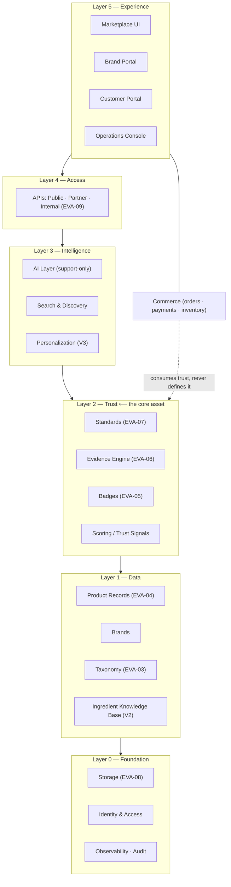
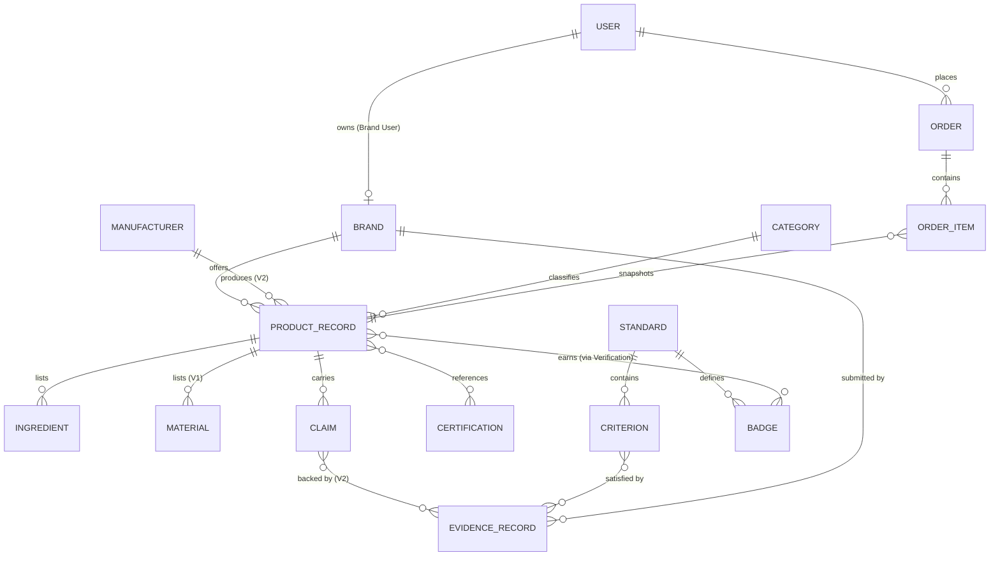
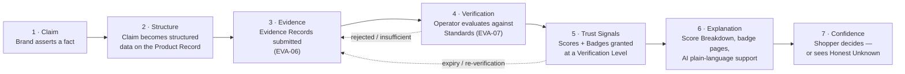
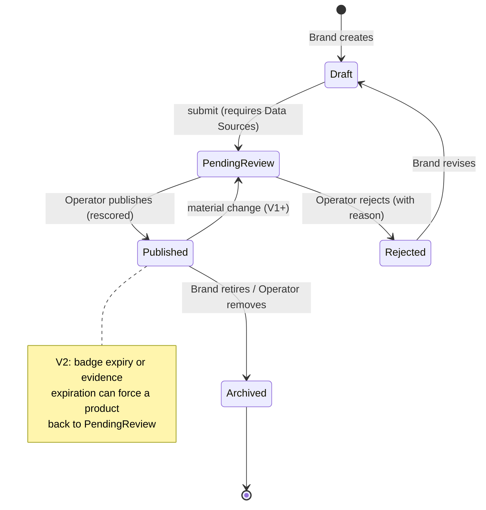
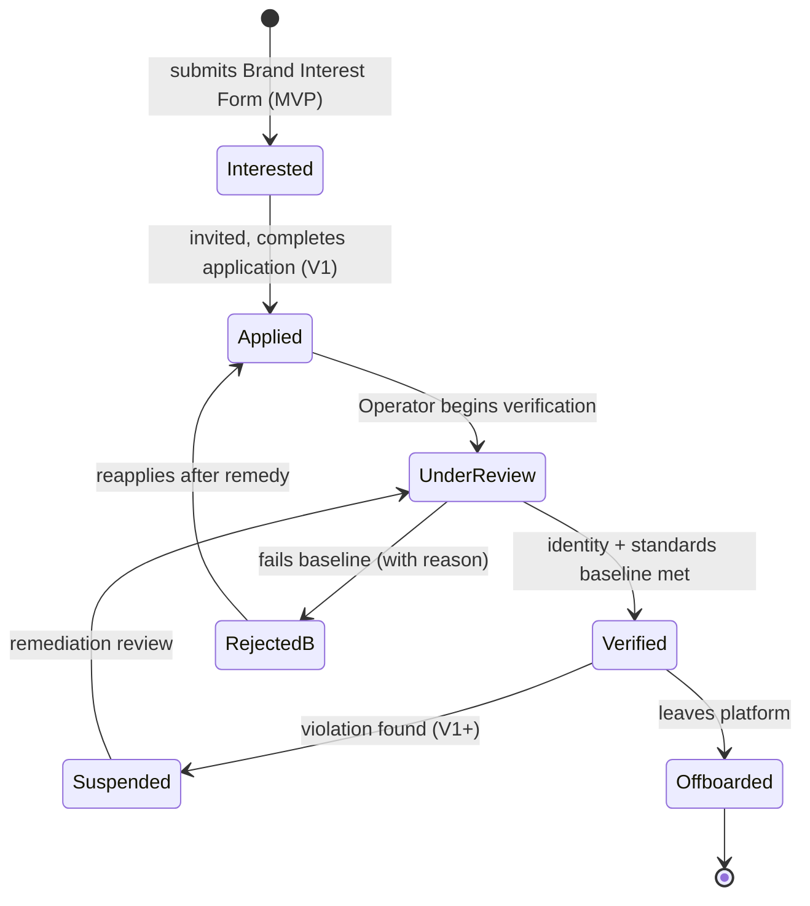
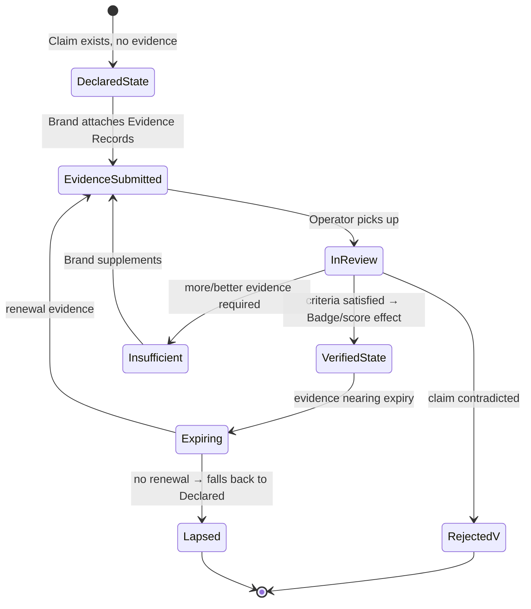
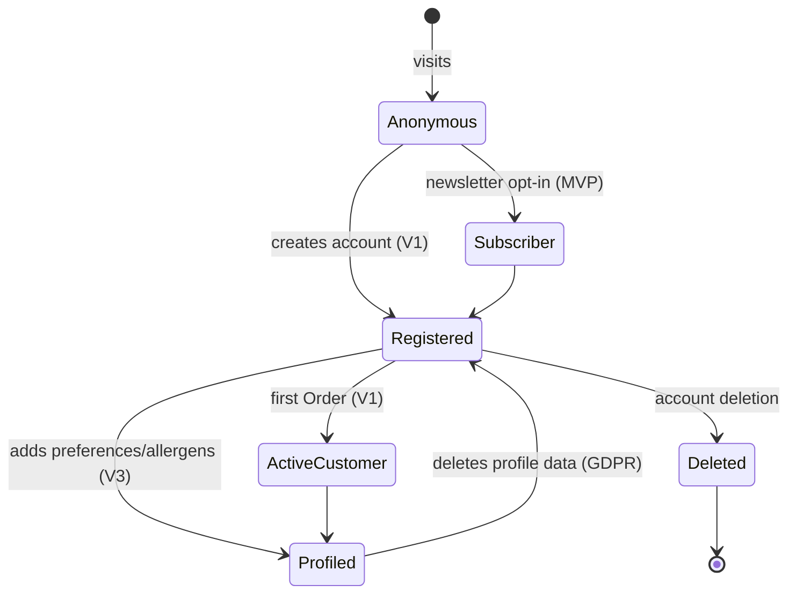

# Evergreen Product Architecture

| | |
|---|---|
| **Document ID** | EVA-02 |
| **Status** | Active |
| **Version** | 1.0.0 |
| **Owner** | Architecture Guild |
| **Last updated** | 2026-07-05 |

---

## 1. Purpose

Define the macro-structure of the Evergreen platform: its layers, its domain
boundaries, the relationships between core entities, and the lifecycles that every
major object moves through. This is the map that all more-detailed documents
(schema, badges, evidence, database, API) fit into.

## 2. Scope

**In scope:** platform layers, bounded contexts (domain boundaries), high-level
entity relationships, the trust flow, and the Product, Brand, Verification, and User
lifecycles (state models).

**Out of scope:** field-level schema ([EVA-04](EVERGREEN_PRODUCT_SCHEMA.md)),
verification *operations* ([EVA-06](EVERGREEN_EVIDENCE_ENGINE.md)), storage design
([EVA-08](EVERGREEN_DATABASE_CONCEPT.md)), API surface
([EVA-09](EVERGREEN_API_CONCEPT.md)), navigation/UX structure
([EVA-03](EVERGREEN_INFORMATION_ARCHITECTURE.md)).

## 3. Dependencies

- [EVA-01 Knowledge System](EVERGREEN_KNOWLEDGE_SYSTEM.md) — terminology and
  documentation rules used here.
- [Roadmap](../roadmap/EVERGREEN_MASTER_ROADMAP.md) — phases and the 18 domains this
  architecture organizes into bounded contexts.
- [Prototype implementation record](../ARCHITECTURE.md) — current implementation of a
  subset of this architecture.

## 4. Related Documents

| Document | Relationship |
|---|---|
| [EVA-04 Product Schema](EVERGREEN_PRODUCT_SCHEMA.md) | Expands the Product Record entity defined here |
| [EVA-05 Badge System](EVERGREEN_BADGE_SYSTEM.md) | Expands the Badge entity and its rules |
| [EVA-06 Evidence Engine](EVERGREEN_EVIDENCE_ENGINE.md) | Operationalizes the Verification lifecycle (§6.7) |
| [EVA-07 Standard Library](EVERGREEN_STANDARD_LIBRARY.md) | Defines the Standards the trust flow evaluates against |
| [EVA-08 Database Concept](EVERGREEN_DATABASE_CONCEPT.md) | Persists the entities in §6.3 |
| [EVA-09 API Concept](EVERGREEN_API_CONCEPT.md) | Exposes these domains as APIs |
| [EVA-10 System Principles](EVERGREEN_SYSTEM_PRINCIPLES.md) | Principles this structure embodies |

## 5. Definitions

This document owns: **Platform Layer**, **Bounded Context** (as used in Evergreen),
**Trust Flow**, **Trust Signals** (collective term — see registry), and the four
lifecycle state models. All other terms:
[EVA-01 §7](EVERGREEN_KNOWLEDGE_SYSTEM.md#7-canonical-terminology-registry).

## 6. Architecture

### 6.1 Platform layers

Evergreen is layered so that **trust assets outlive commerce mechanics**. Commerce
can be rebuilt; the trust layer's data and reputation cannot.

Layer rules:

1. **Downward dependencies only.** A layer may depend on layers below it, never above.
2. **Commerce is a consumer of Trust, never a definer.** Nothing in the Commerce
   domain may influence scores, badges, or verification outcomes (see
   [EVA-10](EVERGREEN_SYSTEM_PRINCIPLES.md), *Trust over Growth*).
3. **Intelligence is support-only.** Layer 3 explains and retrieves; it never decides
   verification outcomes (*Human Review before Automation*).

### 6.2 Domain boundaries (bounded contexts)

The Roadmap's 18 organizational domains group into **six bounded contexts** for
software purposes. A bounded context owns its entities and exposes them to other
contexts only through defined interfaces (in-process modules today, potential
services later — see §9).

| Bounded context | Owns | Roadmap domains covered | Phase active |
|---|---|---|---|
| **Identity & Access** | User, Session, Role, Permissions | Foundation (auth), Customer Portal (accounts) | prototype/V1 |
| **Catalog** | Product Record, Brand, Manufacturer, Category, Ingredient, Material | Marketplace (data), Product Data | MVP |
| **Trust** | Standard, Criterion, Claim, Evidence Record, Verification, Badge, Scores | Transparency System, Standards, Badge System, Evidence Engine, Trust & Compliance | MVP (scores) → V2 (full) |
| **Commerce** | Order, Order Item, Payment, Inventory movement | Marketplace (transactions) | V1 (pilot) |
| **Intelligence** | Search index, AI explanations, personalization profiles | AI Layer, Growth (SEO data), Customer Portal (preferences) | MVP (basic) → V3 |
| **Platform Operations** | Moderation queues, audit log, ops workflows | Admin & Operations, Legal & Governance (records) | MVP (minimal) |

Boundary rules:

- **Catalog ↔ Trust:** Trust references Catalog entities by ID; Catalog stores only
  *snapshots* of Trust outputs (persisted scores, badge grants) for fast reads.
  Trust is always recomputable ([prototype precedent](../ARCHITECTURE.md)).
- **Commerce ↔ Catalog:** Commerce denormalizes what it needs at order time (name,
  price) so historical Orders never break when Product Records change.
- **Intelligence ↔ everything:** read-only. The AI Layer receives structured data and
  returns text/rankings; it holds no writable state of record.
- **Identity is universal:** every context references User/Brand identities from
  Identity & Access; none redefines them.

### 6.3 Entity relationship overview

Field-level detail: [EVA-04](EVERGREEN_PRODUCT_SCHEMA.md). Persistence detail:
[EVA-08](EVERGREEN_DATABASE_CONCEPT.md).

### 6.4 Trust flow

The end-to-end path from a Brand's assertion to a Shopper's confidence — the
platform's central value chain:

Invariants (each enforced by the owning document):

| # | Invariant | Enforced in |
|---|---|---|
| 1 | A Claim without Evidence is displayed as *Declared*, never as verified | EVA-06 |
| 2 | Every Trust Signal is explainable down to factors/evidence | EVA-05, prototype scoring |
| 3 | Missing data renders as Honest Unknown at every step | EVA-10 |
| 4 | Verification outcomes are immune to commercial pressure | EVA-10, Roadmap §3.17 |
| 5 | Trust Signals carry the Standard/rule-set version that produced them | EVA-07, EVA-08 |

### 6.5 Product lifecycle

State model for a Product Record. The prototype implements these states today
(`product_status` enum); `V2` adds the re-verification loop.

Rules:
- Transition to `PendingReview` is blocked without at least one Data Source
  (mandatory-provenance rule, already enforced in the prototype).
- `Published` always carries current Trust Signals; publishing triggers a rescore.
- A *material change* (ingredients, packaging, claims) on a published product
  re-enters review from `V1`; cosmetic edits (typos, images) do not.
- Nothing is hard-deleted; `Archived` records remain resolvable for old Orders and
  audit (see [EVA-08](EVERGREEN_DATABASE_CONCEPT.md) soft-delete policy).

### 6.6 Brand lifecycle

Rules:
- In `MVP` the funnel stops at `Interested` + concierge onboarding
  ([Roadmap §4](../roadmap/EVERGREEN_MASTER_ROADMAP.md)); the prototype's
  `pending/verified/rejected` maps to `Applied/Verified/RejectedB`.
- Only `Verified` Brands can have `Published` Product Records.
- `Suspended` hides the Brand's products from discovery but preserves all data and
  order history; suspension reasons are recorded in the audit log.

### 6.7 Verification lifecycle

State model for a single Verification (a Claim or Badge grant being evaluated).
The operational workflow — queues, reviewer tiers, risk-based depth — is owned by
[EVA-06](EVERGREEN_EVIDENCE_ENGINE.md).

Key property: **verification decays**. A `VerifiedState` outcome is never permanent;
it is tied to Evidence Records with expiry dates. Lapse degrades the display to
*Declared* — it does not delete the Claim (Honest Unknown, not punishment).

### 6.8 User lifecycle

Rules:
- `MVP` supports only `Anonymous` and `Subscriber` (accounts dormant per Roadmap §4).
- `Profiled` data (allergens, values) is privacy-sensitive: minimized, exportable,
  deletable, and never used for advertising ([EVA-10](EVERGREEN_SYSTEM_PRINCIPLES.md)).
- Deletion erases personal data but preserves anonymized Order records required for
  accounting (see [EVA-08](EVERGREEN_DATABASE_CONCEPT.md) audit rules).

## 7. Risks

| Risk | Impact | Mitigation |
|---|---|---|
| Layer erosion (commerce logic leaking into Trust) | Corrupts the core asset | Boundary rule 6.1-2; review gate; principle *Trust over Growth* |
| Bounded contexts as premature microservices | Overengineering, ops burden | Contexts are **module boundaries first**; services only when scale forces it (§9) |
| Lifecycle divergence between docs and code enums | Confusing states, broken flows | Prototype enums are the canonical state names; changes require ADR |
| Snapshot staleness (Catalog holds outdated Trust outputs) | Wrong scores shown | Rescore triggers on publish + rule-set change (prototype `rescore-all` precedent) |

## 8. Future Evolution

- **V1:** Commerce context activates (pilot); Brand lifecycle gains `Suspended`;
  material-change re-review.
- **V2:** Trust context completes (Evidence Engine, Standards v1); Verification
  lifecycle fully operational; Manufacturer entity added.
- **V3:** Intelligence context gains personalization profiles; comparison and
  alternatives services.
- **Global:** contexts become independently deployable where scale requires
  (candidates: Search, Evidence storage); API layer becomes a product (EVA-09).

## 9. Open Questions

1. **Service extraction trigger:** what measurable threshold (traffic, team size,
   deploy contention) justifies splitting a bounded context into a service?
   Default: none before `V2`.
2. **Marketplace commerce model for V1 pilot** (merchant-of-record vs. commission vs.
   link-out) — owned by Roadmap §3.5, affects the Commerce context depth here.
3. Should Claims exist as first-class entities in `MVP` (currently implicit in
   product attributes) or only from `V2`? Leaning: implicit until Evidence Engine
   arrives; EVA-04 models the target shape.

## 10. Decision Log

| Date | Version | Change | Rationale |
|---|---|---|---|
| 2026-07-05 | 1.0.0 | Initial version | Establish macro-structure before detailed domain documents |

## 11. References

- [EVA-01 Knowledge System](EVERGREEN_KNOWLEDGE_SYSTEM.md)
- [Roadmap](../roadmap/EVERGREEN_MASTER_ROADMAP.md) §2 (phases), §3 (domains)
- [Prototype implementation record](../ARCHITECTURE.md)
- Evans, *Domain-Driven Design* (bounded context concept)
