# Evergreen Product Schema

| | |
|---|---|
| **Document ID** | EVA-04 |
| **Status** | Active |
| **Version** | 1.0.0 |
| **Owner** | Architecture Guild |
| **Last updated** | 2026-07-05 |

---

## 1. Purpose

Define the **master schema of the Product Record** and its satellite entities — the
complete field inventory Evergreen is designed to hold, across all phases. This is
the target shape; each phase implements a subset (phase column per field group).
The prototype ([schema.sql](../../backend/db/schema.sql)) implements the `MVP`
subset today.

## 2. Scope

**In scope:** every field group of the Product Record; the Brand, Manufacturer,
Category, Certification satellite entities as they relate to products; relationship
and extensibility rules.

**Out of scope:** storage/versioning mechanics ([EVA-08](EVERGREEN_DATABASE_CONCEPT.md)),
badge earning rules ([EVA-05](EVERGREEN_BADGE_SYSTEM.md)), evidence workflow
([EVA-06](EVERGREEN_EVIDENCE_ENGINE.md)), standards content
([EVA-07](EVERGREEN_STANDARD_LIBRARY.md)), API serialization
([EVA-09](EVERGREEN_API_CONCEPT.md)).

## 3. Dependencies

- [EVA-01 Knowledge System](EVERGREEN_KNOWLEDGE_SYSTEM.md) — terminology.
- [EVA-02 Product Architecture](EVERGREEN_PRODUCT_ARCHITECTURE.md) — entity map and
  lifecycles; this document expands the `PRODUCT_RECORD` node.
- [EVA-03 Information Architecture](EVERGREEN_INFORMATION_ARCHITECTURE.md) — facets
  must map 1:1 to fields defined here.

## 4. Related Documents

| Document | Relationship |
|---|---|
| [EVA-05 Badge System](EVERGREEN_BADGE_SYSTEM.md) | Consumes claim/attribute fields; owns Badge semantics |
| [EVA-06 Evidence Engine](EVERGREEN_EVIDENCE_ENGINE.md) | Owns Evidence Record entity linked from §6.9 |
| [EVA-07 Standard Library](EVERGREEN_STANDARD_LIBRARY.md) | Standards reference these fields in Criteria |
| [EVA-08 Database Concept](EVERGREEN_DATABASE_CONCEPT.md) | Persists this schema; owns versioning/audit |
| [Prototype schema.sql](../../backend/db/schema.sql) | Current `MVP` implementation subset |

## 5. Definitions

This document owns: **Product Record** (structure), **Ingredient**, **Material**,
**Data Source** (field semantics), **Concern Level**, **Attribute**, and the
satellite entities' product-facing fields. Other terms:
[EVA-01 §7](EVERGREEN_KNOWLEDGE_SYSTEM.md#7-canonical-terminology-registry).

**Field table legend:** *Req* = required for publishing · *Phase* = first phase the
field exists · **⬥** = implemented in the prototype today. Types are conceptual
(`text`, `number`, `money`, `bool?` = three-state boolean with unknown, `enum`,
`ref` = link to another entity, `list<…>`).

**Global rule — Honest Unknown at field level:** every optional field has an
explicit unknown representation (`null`, `unknown` enum value, or `declared=false`
flag). Absence of data is *information* and is preserved, displayed, and filterable
([EVA-03 §6.8](EVERGREEN_INFORMATION_ARCHITECTURE.md)).

## 6. Architecture

### 6.1 Schema overview

```mermaid
erDiagram
    PRODUCT_RECORD ||--o{ INGREDIENT : "6.5"
    PRODUCT_RECORD ||--o{ MATERIAL : "6.6"
    PRODUCT_RECORD ||--|| PACKAGING : "6.7"
    PRODUCT_RECORD ||--o| MANUFACTURING : "6.8"
    PRODUCT_RECORD ||--o{ CLAIM : "6.10"
    PRODUCT_RECORD }o--o{ CERTIFICATION : "6.12"
    PRODUCT_RECORD }o--o{ BADGE_GRANT : "6.11"
    PRODUCT_RECORD ||--o{ MEDIA_ASSET : "6.14"
    PRODUCT_RECORD ||--o{ PRODUCT_DOCUMENT : "6.15"
    PRODUCT_RECORD ||--o| ENVIRONMENTAL_DATA : "6.16"
    PRODUCT_RECORD ||--o| SOCIAL_DATA : "6.17"
    PRODUCT_RECORD ||--o| HEALTH_DATA : "6.18"
    PRODUCT_RECORD ||--o| LIFECYCLE_DATA : "6.19"
    PRODUCT_RECORD ||--o{ ATTRIBUTE : "6.21 extensibility"
    PRODUCT_RECORD }o--|| BRAND : "6.3"
    PRODUCT_RECORD }o--o| MANUFACTURER : "6.4"
    PRODUCT_RECORD }o--|| CATEGORY : "6.2"
    CLAIM }o--o{ EVIDENCE_RECORD : "EVA-06"
    PRODUCT_RECORD }o--o{ PRODUCT_RECORD : "6.20 relations"
```

### 6.2 Product Record — identity & classification

| Field | Type | Req | Phase | Notes |
|---|---|---|---|---|
| `id` ⬥ | uuid | ✓ | MVP | Immutable |
| `slug` ⬥ | text | ✓ | MVP | Permanent, redirect on rename ([EVA-03 §6.5](EVERGREEN_INFORMATION_ARCHITECTURE.md)) |
| `name` ⬥ | text | ✓ | MVP | Consumer-facing name |
| `subtitle` | text | — | V1 | Variant/size descriptor |
| `description` ⬥ | text | — | MVP | Prose; may be AI-drafted, brand-confirmed |
| `brand_id` ⬥ | ref Brand | ✓ | MVP | |
| `manufacturer_id` | ref Manufacturer | — | V2 | Distinct from Brand (registry) |
| `category_id` ⬥ | ref Category | ✓ | MVP | Exactly one primary ([EVA-03 §6.6](EVERGREEN_INFORMATION_ARCHITECTURE.md)) |
| `gtin` | text | — | V1 | Barcode/EAN; global dedup key |
| `status` ⬥ | enum | ✓ | MVP | Product lifecycle states ([EVA-02 §6.5](EVERGREEN_PRODUCT_ARCHITECTURE.md)) |
| `product_type` | enum | ✓ | V1 | `formulation` (ingredients) vs `assembly` (materials) — drives §6.5 vs §6.6 |

### 6.3 Brand (product-facing fields)

Owned by the Catalog context ([EVA-02 §6.2](EVERGREEN_PRODUCT_ARCHITECTURE.md));
lifecycle in EVA-02 §6.6.

| Field | Type | Req | Phase | Notes |
|---|---|---|---|---|
| `id` / `slug` / `name` ⬥ | — | ✓ | MVP | |
| `description` / `website` / `country` ⬥ | text | — | MVP | |
| `verification_status` ⬥ | enum | ✓ | MVP | Brand lifecycle state |
| `owner_user_id` ⬥ | ref User | ✓ | MVP | The Brand User |
| `founded_year`, `size_band`, `ownership_disclosure` | text/enum | — | V2 | Corporate transparency |
| `values_statement` | text | — | V1 | Displayed verbatim, marked as brand-declared |

### 6.4 Manufacturer (`V2`)

| Field | Type | Notes |
|---|---|---|
| `id`, `name`, `country`, `site_address` | — | A physical production organization/facility |
| `facility_certifications` | list<ref Certification> | e.g. GMP, ISO — facility-level, not product-level |
| `audit_status` | enum | Fed by Evidence Engine audits |
| `brands_served` | relation | Many-to-many; supports "who really makes this" transparency |

### 6.5 Ingredients (formulation products)

One ordered list per Product Record; each entry ⬥:

| Field | Type | Req | Phase | Notes |
|---|---|---|---|---|
| `position` ⬥ | number | ✓ | MVP | Label (INCI) order |
| `name` ⬥ | text | ✓ | MVP | Common name |
| `inci_name` ⬥ | text | — | MVP | Canonical INCI |
| `role` ⬥ | text | — | MVP | Function (emollient, preservative…) |
| `concern_level` ⬥ | enum | ✓ | MVP | `none·low·moderate·high·unknown`; default `unknown` |
| `note` ⬥ | text | — | MVP | e.g. "EU-declared allergen" |
| `source` ⬥ | text | — | MVP | Per-ingredient provenance |
| `concentration_band` | enum | — | V2 | `<1% / 1–5% / …` — bands, not trade secrets |
| `origin_type` | enum | — | V2 | `natural / naturally-derived / synthetic / unknown` |
| `knowledge_base_ref` | ref | — | V2 | Link into Ingredient Knowledge Base (Roadmap §3.6) |

### 6.6 Materials (assembly products, `V1`)

Mirror of §6.5 for non-formulation goods (textiles, accessories):

| Field | Type | Notes |
|---|---|---|
| `name`, `component` | text | e.g. "organic cotton" in "outer shell" |
| `percentage` | number? | Share of component weight; `null` = unknown |
| `origin_type` | enum | `natural / recycled / synthetic / unknown` |
| `recyclable` | bool? | Three-state |
| `source` | text | Provenance, as §6.5 |

### 6.7 Packaging

| Field | Type | Req | Phase | Notes |
|---|---|---|---|---|
| `packaging_type` ⬥ | text/enum | — | MVP | e.g. `recycled_glass`; `unknown` allowed |
| `packaging_recyclable` ⬥ | bool? | — | MVP | Three-state |
| `recycled_content_pct` | number? | — | V2 | |
| `refillable` | bool? | — | V1 | Promoted from Attribute (§6.21) once common |
| `plastic_free` | bool? | — | V1 | Same promotion path |
| `packaging_weight_g` | number? | — | V2 | Enables packaging-intensity comparison |
| `components` | list | — | V2 | Per-component material + disposal instruction |

### 6.8 Manufacturing (`V2`)

| Field | Type | Notes |
|---|---|---|
| `origin_country` ⬥ | text | MVP field, kept here conceptually; "made in" |
| `production_sites` | list<ref Manufacturer> | Multi-site products |
| `production_method` | text/enum | e.g. cold-process |
| `energy_disclosure` | enum? | `renewable / mixed / undisclosed` |
| `batch_traceability` | bool? | Whether brand can trace batches |

### 6.9 Evidence & provenance

| Field | Type | Req | Phase | Notes |
|---|---|---|---|---|
| `data_sources` ⬥ | list<text> | ✓ (≥1 to publish) | MVP | Free-text provenance; **the mandatory-provenance rule** |
| `evidence_links` | list<ref Evidence Record> | — | V2 | Typed successor; `data_sources` retained as fallback tier ([EVA-06](EVERGREEN_EVIDENCE_ENGINE.md)) |
| `verification_summary` | derived | — | V2 | Computed rollup: counts per Verification Level |

### 6.10 Claims

Structured assertions ([registry](EVERGREEN_KNOWLEDGE_SYSTEM.md#7-canonical-terminology-registry));
in `MVP` implicit as sustainability Attributes (§6.21), first-class from `V2`:

| Field | Type | Notes |
|---|---|---|
| `claim_type` | ref Standard/Criterion | What is being claimed, in Standards vocabulary (EVA-07) |
| `value` | per type | bool/enum/number claims |
| `declared_by` | ref Brand User + timestamp | Accountability |
| `verification_state` | enum | Verification lifecycle states ([EVA-02 §6.7](EVERGREEN_PRODUCT_ARCHITECTURE.md)) |
| `evidence` | list<ref Evidence Record> | |

### 6.11 Badges (grants on a product)

Badge semantics owned by [EVA-05](EVERGREEN_BADGE_SYSTEM.md); the Product Record
stores only **Badge Grants**: `badge_id`, `granted_at`, `verification_level`,
`expires_at`, `status`.

### 6.12 Certifications (external)

⬥ Admin-curated reference table + product links (prototype). Fields per
certification: `name`, `slug`, `issuer`, `description`, `category`,
`trust_weight` (scoring input). Per link (V2+): `certificate_number`,
`valid_until`, `evidence_link` — upgrading a referenced certification into an
evidence-backed one.

### 6.13 Origin

Covered by `origin_country` (§6.8) plus `V2`: `ingredient_origins` —
per-ingredient origin countries where disclosed — and
`supply_chain_disclosure` (enum: `full / partial / none`).

### 6.14 Images & media

| Field | Type | Req | Phase | Notes |
|---|---|---|---|---|
| `image_url` ⬥ | url | — | MVP | Single primary image (prototype) |
| `media_assets` | list | — | V1 | Typed: `primary / gallery / label_photo / packaging_photo`; S3-stored |
| `label_photo` | asset | required to publish | V2 | The actual product label — ground truth for INCI verification |
| `alt_text` | text | ✓ per asset | V1 | Accessibility requirement |

### 6.15 Documents

Product-level documents (safety data sheets, usage instructions) as
`PRODUCT_DOCUMENT`: `doc_type`, `title`, `file_ref`, `language`, `public` flag.
Distinct from Evidence Records (which belong to Claims and live in the Evidence
Engine with confidentiality tiers — [EVA-06](EVERGREEN_EVIDENCE_ENGINE.md)).

### 6.16 Environmental data (`V2`)

All fields `bool?`/`number?` — unknown-honest:

`carbon_footprint_kg_co2e` (+ `methodology_ref` mandatory if present),
`water_usage_l`, `biodegradable`, `microplastic_free`, `palm_oil_status`
(`free / certified-sustainable / present / unknown`), `transport_mode_disclosure`.

**Rule:** environmental numbers without a stated methodology are rejected at
intake — a number with no method is a marketing claim, not data.

### 6.17 Social data (`V2`)

`labor_certifications` (refs), `living_wage_disclosure` (enum),
`child_labor_policy_ref` (Evidence Record), `supply_chain_audit_status`,
`animal_testing_status` (`none / supplier-level-unknown / required-by-market /
unknown`).

### 6.18 Health data

Strictly **non-advisory** — Evergreen states declared facts, never medical guidance
([EVA-10](EVERGREEN_SYSTEM_PRINCIPLES.md), no health claims):

| Field | Type | Phase | Notes |
|---|---|---|---|
| `allergens` ⬥ | list<text> | MVP | Declared allergen names |
| `allergens_declared` ⬥ | bool | MVP | `false` = unknown, distinct from empty list |
| `regulatory_warnings` | list | V2 | Verbatim required label warnings |
| `ph_value`, `spf` | number? | V2 | Physical measurables, evidence-linkable |
| `age_suitability_declared` | text | V2 | Brand-declared only, labeled as such |

### 6.19 Lifecycle data (`V2`)

Product-usage lifecycle (not the workflow lifecycle of EVA-02):
`shelf_life_months`, `period_after_opening_months`, `disposal_instructions`,
`end_of_life_options` (list: refill program, take-back, recycling stream),
`durability_claim` (+ evidence link).

### 6.20 Relationships between Product Records

| Relation | Cardinality | Phase | Purpose |
|---|---|---|---|
| `variant_of` | many→one | V1 | Sizes/shades of a parent product |
| `successor_of` | one→one | V2 | Reformulations; old record stays for history |
| `refill_for` | many→many | V2 | Links refills to primary containers |
| `alternative_to` | derived only | V3 | Computed by Intelligence, never brand-set (anti-gaming) |
| `bundle_contains` | many→many | V3 | Sets/kits |

### 6.21 Metadata & extensibility

| Field | Type | Notes |
|---|---|---|
| `created_at` / `updated_at` ⬥ | timestamps | |
| `schema_version` | number | Version of this schema the record conforms to ([EVA-08](EVERGREEN_DATABASE_CONCEPT.md) versioning) |
| `locale_content` | map | `Global`: translated name/description per locale; structured fields never localize, only labels do |
| `internal_notes` | text | Operator-only, never public |

**Extensibility mechanism — the Attribute system** ⬥: `(group_name, key, value,
source)` tuples per product (prototype `product_attributes`). Rules:

1. New data needs start life as Attributes (cheap, no migration).
2. An Attribute is **promoted to a first-class field** when it (a) appears on a
   meaningful share of the catalog, (b) drives a facet or Standard, or (c) needs
   typed validation. Promotion is an ADR ([EVA-01 §6.6](EVERGREEN_KNOWLEDGE_SYSTEM.md)).
3. Attribute groups are namespaced (`sustainability.*` exists today); unknown keys
   from brands are quarantined pending Operator approval.
4. Commerce fields (`price_cents`, `currency`, `inventory_qty` ⬥) belong to the
   Commerce context and are listed here only for completeness — they never
   influence Trust computation ([EVA-02 §6.1](EVERGREEN_PRODUCT_ARCHITECTURE.md)).

## 7. Risks

| Risk | Impact | Mitigation |
|---|---|---|
| Schema maximalism (building all fields early) | Overengineering, empty-field UX | Phase column is binding; MVP implements only ⬥ + MVP rows |
| Attribute sprawl (extensibility abused) | Untyped junk data | Namespacing + quarantine + promotion-by-ADR (§6.21) |
| Unverifiable numeric eco-data | Greenwashing vector | Methodology-required rule §6.16 |
| Brand/Manufacturer conflation | Wrong accountability chains | Separate entities from V2; registry terms enforced |
| Free-text `data_sources` becoming permanent | Weak provenance forever | Explicit successor path to Evidence Records (§6.9) |

## 8. Future Evolution

- **V1:** `product_type`, Materials, media assets, variants, GTIN.
- **V2:** Claims first-class, Evidence links, Manufacturer, environmental/social/
  health/lifecycle groups, concentration bands, label photos.
- **V3:** derived relations (alternatives), compatibility inputs for profiles.
- **Global:** locale content, per-market regulatory field packs (market-specific
  required warnings), external ingredient-database interop.

## 9. Open Questions

1. Ingredient Knowledge Base sourcing: license an external INCI database vs. build
   curated internal one (cost vs. control) — blocks §6.5 `knowledge_base_ref`.
2. Are concentration bands (§6.5) acceptable to brands, or does even banded
   disclosure block supply? Needs V1 brand interviews.
3. GTIN as global dedup key: how to handle brands without GTINs (artisan segment)?
4. `product_type` binary (`formulation/assembly`) — is a hybrid type needed
   (e.g., scented candle = both)? Default: allow both lists on one record.

## 10. Decision Log

| Date | Version | Change | Rationale |
|---|---|---|---|
| 2026-07-05 | 1.0.0 | Initial master schema | Target shape fixed before badge/evidence/database docs reference fields |

## 11. References

- [Prototype schema.sql](../../backend/db/schema.sql) — implemented subset
- [EVA-01](EVERGREEN_KNOWLEDGE_SYSTEM.md) · [EVA-02](EVERGREEN_PRODUCT_ARCHITECTURE.md) · [EVA-03](EVERGREEN_INFORMATION_ARCHITECTURE.md)
- INCI nomenclature (EU Cosmetics Regulation 1223/2009 Annexes)
