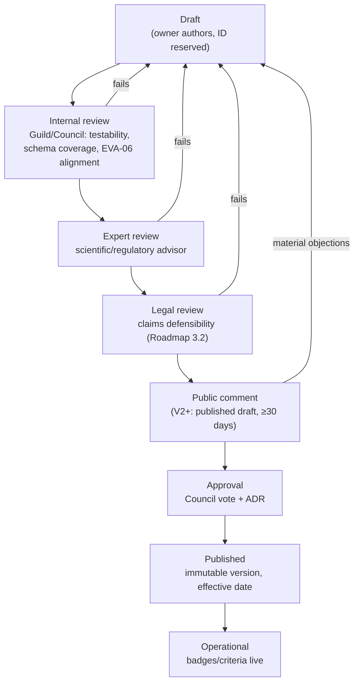

# Evergreen Standard Library

| | |
|---|---|
| **Document ID** | EVA-07 |
| **Status** | Active |
| **Version** | 1.0.0 |
| **Owner** | Architecture Guild (target: Standards Council, V2) |
| **Last updated** | 2026-07-05 |

---

## 1. Purpose

Define the structure, governance, versioning, and category system of the **Evergreen
Standards Library** — the written constitution of what "better" means on Evergreen.
Standards are the normative layer everything else evaluates against: Badges are
defined by them ([EVA-05](EVERGREEN_BADGE_SYSTEM.md)), Evidence is judged against
their Criteria ([EVA-06](EVERGREEN_EVIDENCE_ENGINE.md)), and scores cite them.

This document designs the **library system**, not the standards' content. Content
authoring is a phased program (Roadmap §3.8: v0 in MVP, v1 in V2).

## 2. Scope

**In scope:** the structure of a Standard, the Criterion model, identification and
versioning scheme, ownership and governance, the category system (chemical,
ingredient, packaging, manufacturing, ethical, environmental, social), approval
workflow, grandfathering.

**Out of scope:** specific criteria content (authored per standard), evidence
grading mechanics ([EVA-06](EVERGREEN_EVIDENCE_ENGINE.md)), badge visuals
([EVA-05](EVERGREEN_BADGE_SYSTEM.md)), legal review procedures (Roadmap §3.2).

## 3. Dependencies

- [EVA-01 Knowledge System](EVERGREEN_KNOWLEDGE_SYSTEM.md) — terminology; the
  stricter-publication question for consumer-facing standards (EVA-01 Open
  Questions) is resolved here (§6.6).
- [EVA-04 Product Schema](EVERGREEN_PRODUCT_SCHEMA.md) — Criteria reference schema
  fields; a Criterion may only test data the schema can hold.
- [EVA-06 Evidence Engine](EVERGREEN_EVIDENCE_ENGINE.md) — Risk Levels and evidence
  requirements are declared per Criterion here, consumed there.

## 4. Related Documents

| Document | Relationship |
|---|---|
| [EVA-05 Badge System](EVERGREEN_BADGE_SYSTEM.md) | Every Badge = one Standard + minimum Verification Level |
| [EVA-02 Product Architecture](EVERGREEN_PRODUCT_ARCHITECTURE.md) | Trust flow invariant 5: signals carry Standard versions |
| [EVA-08 Database Concept](EVERGREEN_DATABASE_CONCEPT.md) | Standards versioned as data |
| [Roadmap §3.8](../roadmap/EVERGREEN_MASTER_ROADMAP.md) | Standards domain phasing and risks |

## 5. Definitions

This document owns: **Standard** (structure), **Criterion** (structure),
**Standards Council**, **Grandfathering Window**, **Exclusion List**. Other terms:
[EVA-01 §7](EVERGREEN_KNOWLEDGE_SYSTEM.md#7-canonical-terminology-registry).

## 6. Architecture

### 6.1 Standard structure

Every Standard is a versioned document with a fixed anatomy:

| Section | Content |
|---|---|
| **Identity** | ID (§6.2), name, category, owner, status, version |
| **Intent** | One paragraph: what consumer question this Standard answers |
| **Scope** | Which product types / grantee (product vs. Brand) it applies to |
| **Criteria** | The complete, numbered list of Criteria (see below) |
| **Exclusions** | Explicit disqualifiers (e.g., Exclusion List references) |
| **Evidence requirements** | Per Criterion: accepted Evidence Types, minimum Confidence, Risk Level ([EVA-06](EVERGREEN_EVIDENCE_ENGINE.md)) |
| **Grandfathering** | Window and rules applying to existing grants on version bump |
| **Plain-language summary** | The consumer-facing text badge pages display |
| **Change log** | Version history with rationale |

**Criterion model** — every Criterion is atomic and machine-referenceable:

```
Criterion = {
  id:            EVS-PKG-001.C3          (§6.2)
  requirement:   testable statement referencing EVA-04 fields
  measurement:   how satisfaction is determined
  risk_level:    R1 | R2 | R3            (EVA-06 §6.4)
  evidence:      accepted types + minimum Confidence Level
  unknown_rule:  how missing data affects the outcome (fail vs. n/a)
}
```

Rules:
1. **Testable or absent.** A requirement that cannot be evaluated against schema
   fields plus evidence does not belong in a Standard.
2. **Unknown handling is explicit per Criterion.** Some Criteria fail on unknown
   (an R3 "free-of" claim), others mark not-applicable — never decided ad hoc.
3. **No discretionary Criteria.** "At the Operator's judgment" is not a Criterion;
   judgment lives in evidence grading (EVA-06), not in requirements.

### 6.2 Identification & versioning

**ID scheme:** `EVS-<CAT>-<NNN>` for Standards, `.C<n>` suffix for Criteria.
Category codes: `CHM` chemical · `ING` ingredient · `PKG` packaging ·
`MFG` manufacturing · `ETH` ethical · `ENV` environmental · `SOC` social.
Example: `EVS-PKG-001` *Plastic-Free Packaging Standard*, Criterion
`EVS-PKG-001.C2`.

**Versioning:** semantic, aligned with [EVA-01 §6.4](EVERGREEN_KNOWLEDGE_SYSTEM.md):

| Bump | Meaning | Consequence |
|---|---|---|
| MAJOR | Criteria added/removed/tightened | Re-verification required; Grandfathering Window applies |
| MINOR | Clarification, new evidence type accepted, loosening | Existing grants unaffected |
| PATCH | Wording/typo | None |

Invariants:
- Every Badge Grant and score snapshot records the **exact Standard version** it was
  evaluated against ([EVA-02 §6.4](EVERGREEN_PRODUCT_ARCHITECTURE.md) invariant 5;
  persistence in [EVA-08](EVERGREEN_DATABASE_CONCEPT.md)).
- Published versions are immutable; changes create a new version.
- A **Grandfathering Window** (default 180 days, set per MAJOR bump) lets existing
  grants re-verify against the new version before lapsing — the window and its
  rationale are stated in the Standard itself ([EVA-05 §7](EVERGREEN_BADGE_SYSTEM.md)
  risk).

### 6.3 Ownership

| Phase | Owner |
|---|---|
| MVP–V1 | Architecture Guild authors; external expert review *ad hoc* |
| V2+ | **Standards Council**: internal owner per category + external advisors (scientific/regulatory); council charter is the governance artifact of Roadmap §3.2 |

Each Standard names one accountable owner. Standards without a current owner cannot
be cited by new Badges and are flagged in the quarterly review.

### 6.4 Category system

The library is organized by the seven categories. Initial target inventory
(IDs reserved; content authored per phase):

| Category | Code | Covers | Example Standards (target) | First phase |
|---|---|---|---|---|
| **Chemical** | CHM | Substance-level restrictions beyond law | *Restricted Substances List* (the platform Exclusion List) | v0 in MVP |
| **Ingredient** | ING | Formulation-level rules | *Full Ingredient Disclosure*, *Fragrance-Free*, *Vegan Formulation* | MVP |
| **Packaging** | PKG | Materials, recyclability, waste | *Plastic-Free Packaging*, *Refill-Ready* | MVP |
| **Manufacturing** | MFG | Production practices & traceability | *Batch Traceability*, *Verified Production Site* | V2 |
| **Ethical** | ETH | Testing & business conduct | *Cruelty-Free Practices* | V2 |
| **Environmental** | ENV | Footprint & resource use | *Verified Carbon Disclosure*, *Palm-Oil Transparency* | V2 |
| **Social** | SOC | Labor & supply chain | *Living-Wage Disclosure*, *Supply-Chain Audited* | V3 |

Category rules:
- The **Exclusion List** (`EVS-CHM-001`) is a special, platform-wide Standard: no
  product containing a listed substance above threshold may be `Published`,
  regardless of badges. It is versioned like any Standard but applies universally.
- Standards may reference other Standards' Criteria (composition), never duplicate
  them — the same single-source rule as documentation
  ([EVA-01 §6.1](EVERGREEN_KNOWLEDGE_SYSTEM.md)).
- External schemes (COSMOS, GOTS…) are **mapped, not absorbed**: a mapping table per
  Standard states which external Certifications satisfy which Criteria (as Evidence,
  per [EVA-06 §6.1](EVERGREEN_EVIDENCE_ENGINE.md)).

### 6.5 Approval workflow



- MVP/V1 shortcut: steps C–E may collapse to a single external-reviewer pass; the
  workflow is fully honored from V2 (public comment included).
- Every approval produces an ADR ([EVA-01 §6.6](EVERGREEN_KNOWLEDGE_SYSTEM.md)) and
  a publication on the public standards pages
  ([EVA-03 §6.5](EVERGREEN_INFORMATION_ARCHITECTURE.md) — stable URLs).

### 6.6 Publication pipeline (resolves EVA-01 Open Question 2)

Standards are **consumer-facing, legally sensitive documents** and therefore use a
stricter pipeline than EVA architecture documents: authored in the repository under
`docs/standards/` (from v0), but a version becomes *normative* only after the §6.5
workflow completes — Git merge alone is not publication. The Operational state is
recorded in the database ([EVA-08](EVERGREEN_DATABASE_CONCEPT.md)) so the platform
always knows which version is live.

## 7. Risks

| Risk | Impact | Mitigation |
|---|---|---|
| Too strict → empty catalog; too loose → greenwashing | Existential either way | Roadmap §3.8 risk; v0 starts narrow but honest; public comment from V2 |
| Untestable criteria creep | Verification becomes arbitrary | Testable-or-absent rule §6.1-1 |
| Standards drift from schema capabilities | Criteria reference non-existent data | Dependency rule §3: Criteria may only cite EVA-04 fields; schema PRs check |
| Regulatory divergence between markets | One standard can't hold globally | Market addenda (`Global`), mapping tables §6.4 |
| Council capture (industry influence) | Trust collapse | External advisors, public comment, ADR trail, commercial firewall (EVA-05 §6.6) |

## 8. Future Evolution

- **MVP:** Standards v0 — Exclusion List seed + 3–6 badge-backing standards, short
  form, published on Methodology/badge pages.
- **V1:** standards drive moderation decisions; mapping tables for major external
  schemes.
- **V2:** Standards Council chartered; full approval workflow incl. public comment;
  Standards v1 with per-Criterion evidence requirements; `docs/standards/` pipeline
  live.
- **V3:** social category activated; auditor-facing criterion guidance.
- **Global:** market addenda; translations (English normative); standards citable
  by third parties via stable public URLs + API ([EVA-09](EVERGREEN_API_CONCEPT.md)).

## 9. Open Questions

1. Standards Council composition and veto rules (external majority or internal
   majority with external veto?) — charter decision, V2.
2. Exclusion List seed content: adopt an existing restricted list (e.g., beyond
   EU Annex II) as baseline vs. author from scratch — needs expert advice, MVP.
3. Public-comment mechanics (GitHub-based vs. dedicated portal) — decide with the
   V2 publication pipeline.
4. Should Criteria thresholds be parameterizable per market, or do market addenda
   fork whole Standards? (Leaning: addenda fork Criteria only, never Intent.)

## 10. Decision Log

| Date | Version | Change | Rationale |
|---|---|---|---|
| 2026-07-05 | 1.0.0 | Initial library design; resolves EVA-01 OQ-2 (stricter pipeline: yes, §6.6) | Structure must precede content authoring (Standards v0) |

## 11. References

- [EVA-05](EVERGREEN_BADGE_SYSTEM.md) · [EVA-06](EVERGREEN_EVIDENCE_ENGINE.md) · [EVA-04](EVERGREEN_PRODUCT_SCHEMA.md)
- [Roadmap §3.8](../roadmap/EVERGREEN_MASTER_ROADMAP.md)
- EU Cosmetics Regulation 1223/2009 (Annex II restricted substances — candidate
  Exclusion List baseline)
