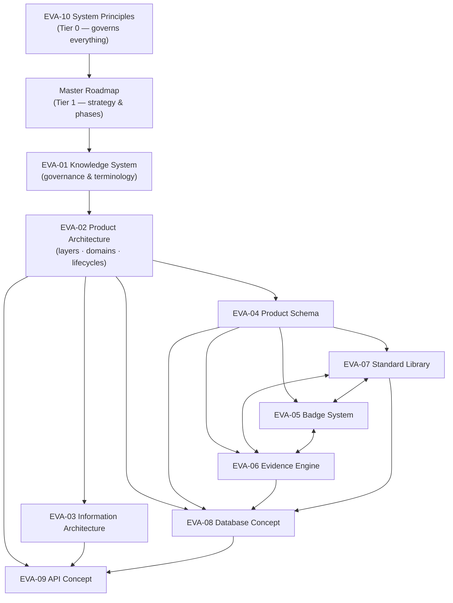

# Evergreen Architecture Index

The architecture documentation set for **Project Evergreen** — a global trust
infrastructure for consumer products. Trust is the product; commerce is the
consequence.

This index is the entry point. The rules governing this documentation (tiers,
ownership, terminology, review) live in
[EVA-01 Knowledge System](EVERGREEN_KNOWLEDGE_SYSTEM.md); the strategy and phasing
live in the [Master Roadmap](../roadmap/EVERGREEN_MASTER_ROADMAP.md).

---

## The architecture in one paragraph

Evergreen is a **layered platform** whose core asset is a Trust layer — Standards,
Evidence, Verification, Badges, and explainable Scores — built on top of deeply
structured product data and consumed by marketplace surfaces, APIs, and (later) an
ecosystem of partners and AI agents. Every trust statement is explainable down to
its factors and evidence; missing data is always an explicit `unknown`; humans
decide, machines assist; commerce consumes trust but can never define it. The
platform grows in five phases (MVP → V1 → V2 → V3 → Global) from a curated,
transparency-first marketplace prototype into reference infrastructure for
trustworthy consumer products.

## Document map

## The documents

| # | Document | One-line purpose |
|---|---|---|
| — | [Master Roadmap](../roadmap/EVERGREEN_MASTER_ROADMAP.md) | Strategy: five phases, 18 domains, MVP priorities (Tier 1) |
| 01 | [Knowledge System](EVERGREEN_KNOWLEDGE_SYSTEM.md) | How knowledge is governed: tiers, ownership, ADRs, review gates, and the **Canonical Terminology Registry** |
| 02 | [Product Architecture](EVERGREEN_PRODUCT_ARCHITECTURE.md) | Platform layers, six bounded contexts, entity map, trust flow, and the Product/Brand/Verification/User lifecycles |
| 03 | [Information Architecture](EVERGREEN_INFORMATION_ARCHITECTURE.md) | Navigation, journeys, taxonomy, search & filtering philosophy — trust legible in the UI |
| 04 | [Product Schema](EVERGREEN_PRODUCT_SCHEMA.md) | The master field inventory of the Product Record across all phases, with extensibility rules |
| 05 | [Badge System](EVERGREEN_BADGE_SYSTEM.md) | Badge families, `Standard + Verification Level` earning model, lifecycle, governance, conflicts |
| 06 | [Evidence Engine](EVERGREEN_EVIDENCE_ENGINE.md) | Evidence types, Verification & Confidence Levels, risk-tiered review workflow, expiry cascades |
| 07 | [Standard Library](EVERGREEN_STANDARD_LIBRARY.md) | Standard/Criterion anatomy, EVS ID scheme, versioning & grandfathering, seven categories, approval workflow |
| 08 | [Database Concept](EVERGREEN_DATABASE_CONCEPT.md) | Logical data model: normalization philosophy, temporal versioning, soft deletes, audit history, scaling path |
| 09 | [API Concept](EVERGREEN_API_CONCEPT.md) | Internal/Public/Partner tiers, authn/z, rate limits, versioning, mobile & AI access, webhooks |
| 10 | [System Principles](EVERGREEN_SYSTEM_PRINCIPLES.md) | The ten Tier-0 principles with decision tests and precedence rules |

**Related, outside this set:** [docs/ARCHITECTURE.md](../ARCHITECTURE.md) — the
Tier-3 implementation record of the current prototype (what exists today).
Decision records live in `docs/architecture/decisions/` (created with the first
ADR; template in [EVA-01 §6.6](EVERGREEN_KNOWLEDGE_SYSTEM.md)).

## Reading paths

- **New engineer / AI agent onboarding:** EVA-10 → Roadmap → EVA-02 → EVA-04 →
  the document for your domain.
- **"Why does the product page look like this?"** EVA-03 → EVA-05 → EVA-02 §6.4
  (trust flow).
- **"How does a claim become a badge?"** EVA-04 §6.10 → EVA-06 → EVA-07 → EVA-05.
- **"How do we store/expose X?"** EVA-04 → EVA-08 → EVA-09.
- **"Can we build feature Y now?"** Roadmap §2 (phase) → EVA-10 (principles) →
  domain document.

## Principle → operationalization map

| Principle (EVA-10) | Primarily operationalized in |
|---|---|
| Trust over Growth | EVA-05 §6.6 (commercial firewall), EVA-06 §7, Roadmap §3.17 |
| Transparency over Marketing | EVA-03 §6.1/§6.4, EVA-09 §6.1 |
| Evidence over Claims | EVA-06 (whole document), EVA-05 §6.2 |
| Honest Unknown | EVA-04 §5, EVA-03 §6.8, EVA-07 §6.1, EVA-09 §6.1 |
| Simple before Complex | EVA-08 §6.9, EVA-03 §6.4, Roadmap §5 |
| Composable Architecture | EVA-02 §6.1/§6.2, EVA-08 §6.1 |
| Reversible Decisions | EVA-01 §6.6, EVA-07 §6.2, EVA-09 §6.6 |
| Documentation First | EVA-01 (whole document) |
| Human Review before Automation | EVA-06 §6.5, EVA-02 §6.1 |
| No Dark Patterns | EVA-03 §6.3/§6.8, EVA-02 §6.8 |

## Conventions

- **Terminology:** all documents use the
  [Canonical Terminology Registry](EVERGREEN_KNOWLEDGE_SYSTEM.md#7-canonical-terminology-registry)
  — start there when a term is unclear.
- **Phases:** `MVP · V1 · V2 · V3 · Global`, defined in the Roadmap. A ⬥ marker in
  field/feature tables means "implemented in the prototype today".
- **Changes:** follow the governance in EVA-01 (versioned documents, ADRs for
  significant decisions, quality gates before merge).
